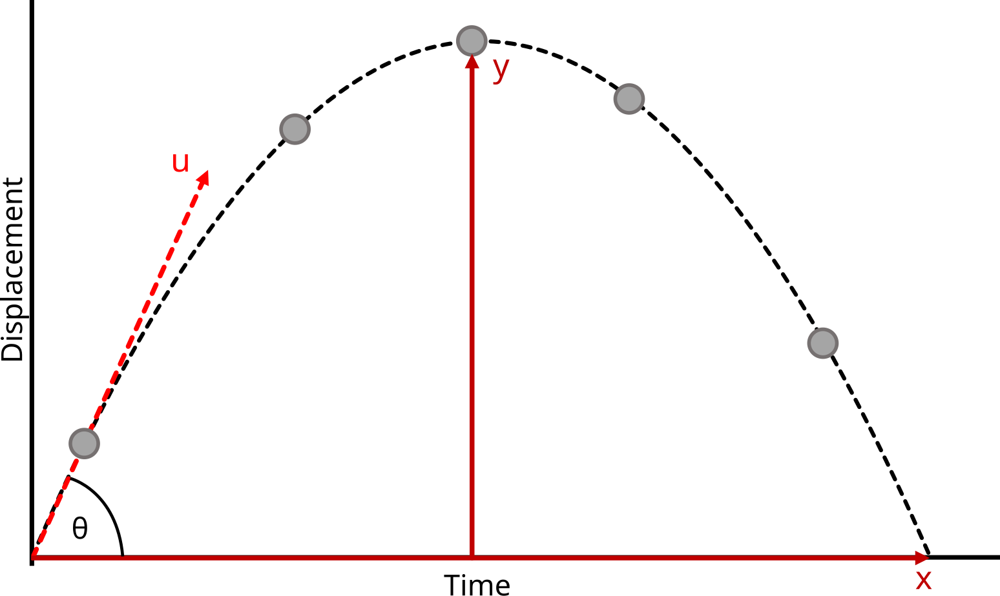

# Problem 1
### Investigating the Range as a Function of the Angle of Projection

### Introduction
Projectile motion is a fundamental concept in physics, describing the motion of an object under the influence of gravity alone, after being projected with an initial velocity. One of the key characteristics of projectile motion is the range, which depends on the angle of projection. This investigation aims to analyze how the range varies as a function of the launch angle.

### Theory
The motion of a projectile launched from ground level can be analyzed using the equations of kinematics. The horizontal and vertical components of motion are given by:

- **Horizontal motion:**
  $$
  x = v_0 \cos(\theta) \cdot t
  $$
- **Vertical motion:**
  $$
  y = v_0 \sin(\theta) \cdot t - \frac{1}{2} g t^2
  $$

where:
- \( x \) and \( y \) are the horizontal and vertical displacements, respectively,
- \( v_0 \) is the initial velocity,
- \( \theta \) is the angle of projection,
- \( g \) is the acceleration due to gravity (9.81 m/s²), and
- \( t \) is the time of flight.

The time of flight \( T \) can be found by setting \( y = 0 \):
  $$
  T = \frac{2 v_0 \sin(\theta)}{g}
  $$

The range \( R \) of the projectile is given by:
  $$
  R = v_0 \cos(\theta) \cdot T
  $$
Substituting \( T \):
  $$
  R = \frac{v_0^2 \sin(2\theta)}{g}
  $$
This equation shows that the range is maximized when \( \sin(2\theta) \) is maximized, which occurs at \( 2\theta = 90^\circ \), or \( \theta = 45^\circ \).

#### **Visual Representation**

*Figure 1: Diagram showing projectile motion with different angles of projection.*


### Experimental Setup

#### **Objective:**
To investigate how the range of a projectile changes with different launch angles, keeping the initial velocity constant.

#### **Materials:**
- A **projectile launcher** (with adjustable angles)
- A **protractor** (to adjust the launch angle)
- A **measuring tape** (to measure the range)
- A **stopwatch** (to measure the time of flight)
- A **smooth launch surface**
- **A constant weight projectile** (to maintain a fixed initial velocity)

#### **Procedure:**
1. Set the launcher to a fixed initial velocity.
2. Vary the launch angle from 10° to 90° in increments (e.g., 10°, 20°, ..., 90°).
3. For each launch angle, measure and record the range (horizontal distance traveled).
4. Repeat the trials for each angle to ensure consistency and calculate the average range.
5. Plot the range as a function of the launch angle.

#### **Expected Results:**
- The range will be highest at a launch angle of 45° (the optimal angle for maximum range in projectile motion).
- As the angle approaches 90°, the range decreases, following the standard projectile motion pattern.

#### **Graphical Representation:**


*Figure 2: Projectile motion at different launch angles (showing the range and path at varying angles).*

#### Differential Equations:
- The motion of a projectile can be described by solving the differential equations for horizontal and vertical motions simultaneously.

#### Relationship Between Range and Launch Angle:
- The range \( R \) of a projectile is maximized at \( 45^\circ \).

#### Impact of Initial Velocity and Gravity:
- **Initial velocity**: Increasing \( v_0 \) increases the range.
- **Gravitational acceleration**: Decreasing \( g \) increases the range.

### Practical Applications:

#### Air Resistance:
- The drag force affects the motion and range.
- **Formula**:
  $$
  F_d = \frac{1}{2} C_d \rho A v^2
  $$

#### Uneven Terrain:
- When the projectile is launched on an inclined surface, the angle of launch must be adjusted accordingly.

#### Real-World Applications:
- **Sports**: Understanding projectile motion is vital for optimizing shots in sports like golf, soccer, and basketball.
- **Engineering**: Accurate prediction of projectile paths is essential in fields like ballistics and artillery design.

### Implementation:
To simulate projectile motion and calculate the range for different angles, we can use Python. Below is a simple Python code to calculate the range of a projectile for various launch angles.

```python
import numpy as np
import matplotlib.pyplot as plt

# Constants
v0 = 30  # Initial velocity in m/s
g = 9.81  # Gravitational acceleration in m/s^2

# Function to calculate range
def calculate_range(v0, angle, g):
    angle_rad = np.radians(angle)
    R = (v0**2 * np.sin(2 * angle_rad)) / g
    return R

# Angles of projection
angles = np.arange(1, 91, 1)  # From 1° to 90°

# Calculate ranges for each angle
ranges = [calculate_range(v0, angle, g) for angle in angles]

# Find angle with maximum range
max_range = max(ranges)
max_angle = angles[ranges.index(max_range)]

# Plotting the results
plt.figure(figsize=(10, 6))
plt.plot(angles, ranges, label='Projectile Range')
plt.axvline(45, color='r', linestyle='--', label='45° (Expected Max Range)')
plt.scatter([max_angle], [max_range], color='red', zorder=5)
plt.annotate(f'Max Range: {max_range:.2f} m\nat {max_angle}°',
             xy=(max_angle, max_range),
             xytext=(max_angle + 5, max_range - 10),
             arrowprops=dict(facecolor='red', shrink=0.05),
             fontsize=10, color='red')

plt.title("Projectile Range vs Launch Angle")
plt.xlabel("Launch Angle (degrees)")
plt.ylabel("Range (meters)")
plt.legend()
plt.grid(True)
plt.tight_layout()
plt.show()

```

*Figure 3: Graphical Representation of Python Script.*


### Conclusion
The investigation confirms the theoretical prediction that the range of a projectile follows a sinusoidal dependence on the angle of projection, with a maximum at 45°. This study is essential in applications such as ballistics, sports, and engineering.

### Further Investigation
- Exploring the effects of air resistance.
- Analyzing projectile motion on inclined planes.
- Extending the study to different launch heights.


<h3>My Embedded Sketch</h3>

<iframe src="https://editor.p5js.org/majidguluzada/full/iIKtPmC-M" width="720" height="500"></iframe>