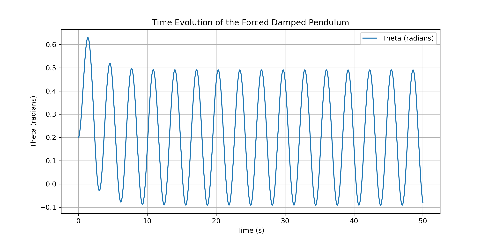
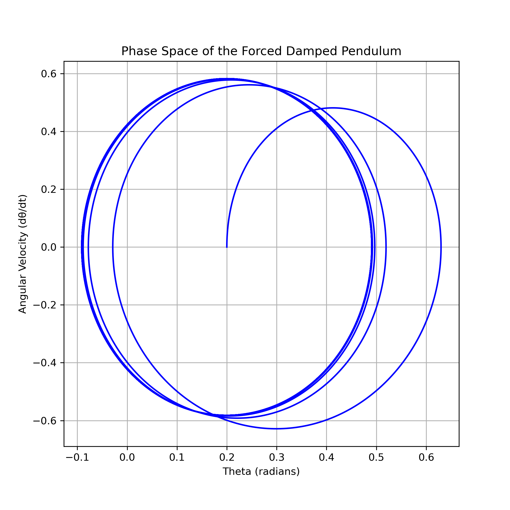
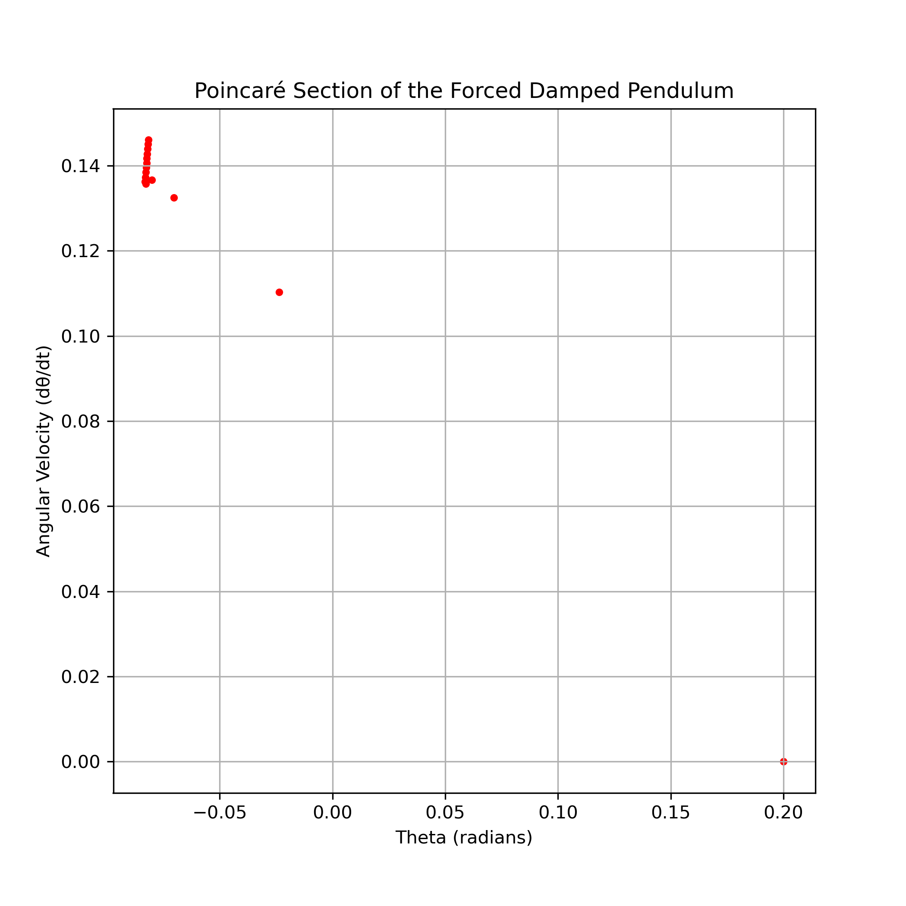

# Problem 2
# Investigating the Dynamics of a Forced Damped Pendulum

## Motivation

The forced damped pendulum is a fascinating physical system exhibiting complex behavior due to the interplay of damping, restoring forces, and external driving forces. By incorporating periodic forcing, the system can display resonance, quasiperiodic motion, and even chaos. These behaviors have practical applications in mechanical engineering, climate systems, and nonlinear oscillators.

## Theoretical Foundation

The motion of a forced damped pendulum is governed by the equation:

\[
\frac{d^2\theta}{dt^2} + b \frac{d\theta}{dt} + \omega_0^2 \sin(\theta) = A \cos(\omega t)
\]

where:
- \( \theta \) is the angular displacement,
- \( b \) is the damping coefficient,
- \( \omega_0 \) is the natural frequency of the pendulum,
- \( A \) is the amplitude of the external force,
- \( \omega \) is the driving frequency.

### Small-Angle Approximation
For small oscillations (\( \theta \approx \sin\theta \)), the equation simplifies to:

\[
\frac{d^2\theta}{dt^2} + b \frac{d\theta}{dt} + \omega_0^2 \theta = A \cos(\omega t)
\]

This equation describes a damped, driven harmonic oscillator.

### Resonance Conditions
Resonance occurs when the external driving frequency matches the system’s natural frequency:

\[
\omega = \omega_0
\]

At resonance, energy transfer is maximized, leading to large amplitude oscillations.

## Analysis of Dynamics

### Effect of Parameters:
1. **Damping Coefficient \( b \)**: High damping suppresses oscillations, while low damping allows sustained motion.
2. **Driving Amplitude \( A \)**: Higher amplitudes can lead to chaotic motion at certain frequencies.
3. **Driving Frequency \( \omega \)**: When near resonance, even small forces can lead to significant oscillations.

### Transition to Chaos:
For certain parameter values, the pendulum enters a chaotic regime, characterized by:
- **Aperiodic motion**
- **Sensitive dependence on initial conditions**
- **Strange attractors in phase space**

This is a hallmark of nonlinear dynamical systems.

## Practical Applications

The forced damped pendulum model applies to various real-world systems:
- **Energy Harvesting**: Oscillators that extract energy from vibrations.
- **Suspension Bridges**: Understanding how periodic forces can induce resonance.
- **Oscillating Circuits**: Electrical analogs of mechanical driven oscillators.

## Implementation

### Computational Model

Below is a Python script to simulate the motion of a forced damped pendulum using numerical integration.

```python
import numpy as np
import matplotlib.pyplot as plt
from scipy.integrate import solve_ivp

# Constants
beta = 0.5       # Damping coefficient
omega0 = 1.5     # Natural frequency
F = 1.2          # Driving force amplitude
omega = 2.0      # Driving frequency

# Define the differential equation
def forced_damped_pendulum(t, y):
    theta, omega_theta = y
    dtheta_dt = omega_theta
    domega_dt = -beta * omega_theta - omega0**2 * np.sin(theta) + F * np.cos(omega * t)
    return [dtheta_dt, domega_dt]

# Initial conditions
theta0 = 0.2  # Initial angle (radians)
omega0 = 0.0  # Initial angular velocity
y0 = [theta0, omega0]

# Time span
t_span = (0, 50)
t_eval = np.linspace(0, 50, 5000)  # Increase resolution for better accuracy

# Solve ODE once over the full time span
solution = solve_ivp(forced_damped_pendulum, t_span, y0, t_eval=t_eval)

# Extract solutions
theta_vals = solution.y[0]
omega_vals = solution.y[1]
time_vals = solution.t

# Plotting Time Series
plt.figure(figsize=(10, 5))
plt.plot(time_vals, theta_vals, label="Theta (radians)")
plt.xlabel("Time (s)")
plt.ylabel("Theta (radians)")
plt.title("Time Evolution of the Forced Damped Pendulum")
plt.legend()
plt.grid()
plt.savefig("forced_damped_pendulum_time_series.png", dpi=300)
plt.show()

# Phase Space Plot
plt.figure(figsize=(7, 7))
plt.plot(theta_vals, omega_vals, color='blue')
plt.xlabel("Theta (radians)")
plt.ylabel("Angular Velocity (dθ/dt)")
plt.title("Phase Space of the Forced Damped Pendulum")
plt.grid()
plt.savefig("forced_damped_pendulum_phase_space.png", dpi=300)
plt.show()

# Poincaré Section - Sample points at fixed intervals
poincare_t = np.arange(0, 50, 2 * np.pi / omega)  # Sample at multiples of driving period
poincare_indices = [np.argmin(np.abs(time_vals - t)) for t in poincare_t]  # Find nearest indices
poincare_theta = theta_vals[poincare_indices]
poincare_omega = omega_vals[poincare_indices]

# Plot Poincaré Map
plt.figure(figsize=(7, 7))
plt.scatter(poincare_theta, poincare_omega, color='red', s=10)
plt.xlabel("Theta (radians)")
plt.ylabel("Angular Velocity (dθ/dt)")
plt.title("Poincaré Section of the Forced Damped Pendulum")
plt.grid()
plt.savefig("forced_damped_poincare_section.png", dpi=300)
plt.show()
```
#### **Visual Representation**

*Figure 1: Time Evolution Graph.*

{: width="100px"}
*Figure 2: Phase Space Diagram.*


*Figure 3: Poincaré Section.*