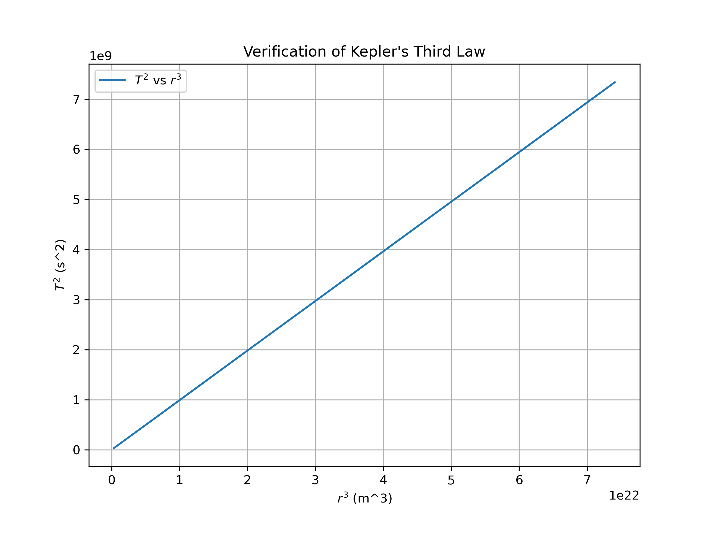

# Problem 1
# Orbital Period and Orbital Radius

## Motivation
Kepler's Third Law of Planetary Motion states that the square of the orbital period (\( T \)) of a planet is directly proportional to the cube of its orbital radius (\( r \)). This is an essential relationship in celestial mechanics, providing insight into the motions of planets, satellites, and even artificial satellites. The law allows us to understand how the gravitational forces between celestial bodies determine their orbital characteristics.

Kepler's Third Law can also be generalized to include the mass of the central object, which governs the dynamics of the orbit. It provides a critical tool in astronomy, especially in determining the properties of distant celestial objects like exoplanets, as well as the behavior of natural and artificial satellites.

## Derivation of Kepler's Third Law
For a body in a circular orbit around a central mass \( M \), the gravitational force (\( F_g \)) provides the necessary centripetal force (\( F_c \)) to maintain the orbit:

- The gravitational force is given by:

  $$ F_g = \frac{G M m}{r^2} $$

  where:
  - \( G \) is the gravitational constant,
  - \( M \) is the mass of the central body,
  - \( m \) is the mass of the orbiting object,
  - \( r \) is the orbital radius.

- The centripetal force required to maintain the orbit is given by:

  $$ F_c = \frac{m v^2}{r} $$

  where:
  - \( v \) is the orbital velocity of the body.

Setting the gravitational force equal to the centripetal force:

$$ \frac{G M m}{r^2} = \frac{m v^2}{r} $$

Canceling \( m \) from both sides and solving for \( v^2 \):

$$ v^2 = \frac{G M}{r} $$

Now, the orbital period \( T \), which is the time it takes for the body to complete one full orbit, is related to the orbital velocity by:

$$ T = \frac{2\pi r}{v} $$

Substitute the expression for \( v \):

$$ T = \frac{2\pi r}{\sqrt{\frac{G M}{r}}} $$

Simplifying the equation:

$$ T = 2\pi \sqrt{\frac{r^3}{G M}} $$

Squaring both sides to eliminate the square root:

$$ T^2 = \frac{4\pi^2 r^3}{G M} $$

This final equation confirms the fundamental relationship:

$$ T^2 \propto r^3 $$

This result means that if you plot \( T^2 \) versus \( r^3 \) for any orbiting object, the graph will produce a straight line, and the proportionality constant depends on the mass of the central body.

## Applications in Astronomy
Kepler's Third Law is crucial for several astronomical applications:

- **Planetary Orbital Analysis**: It allows astronomers to calculate the orbital period and radius of planets in the solar system or exoplanets in distant star systems.
- **Satellite Orbit Calculations**: For artificial satellites, this law helps to predict their orbital period given the radius from the Earth's center.
- **Exoplanet Detection**: When a planet passes in front of its host star (a transit event), astronomers can measure the time between transits to estimate the orbital period. From there, the orbital radius can be inferred using Kepler's Third Law.
- **Gravitational Dynamics**: The relationship is also used in understanding binary star systems, where the orbital period of the stars can help determine the system's mass and size.


*Figure 1: Two notions of distance for the problem of learning Kepler’s third law of planetary motion from solar-system.*

### Explanation of Kepler’s Third Law and Model Representation

This section presents the numerical data, background theory, and the discovered model for **Kepler’s third law of planetary motion**, which describes the relationship between the orbital period of a planet and its distance from the Sun. The data used in the model includes the following parameters for each planet: the mass of the Sun (**m₁**), the mass of the planet (**m₂**), the distance of the planet from the Sun (**d**), and the orbital period of the planet (**p**).

The background theory relies on **Newton’s laws of motion**, which explain the centrifugal force, gravitational force, and equilibrium conditions. These laws are fundamental in deriving the relationship between the orbital period and the planet's distance from the Sun. By applying these principles, the 4-tuples (**m₁**, **m₂**, **d**, **p**) are projected into the new variables (**m₁ + m₂**, **d**, **p**). The relationship is visualized through two manifolds, which represent the solutions derived from the background theory and the discovered model.

---

The numerical data, background theory, and a discovered model are depicted for **Kepler’s third law of planetary motion**, giving the orbital period of a planet in the solar system. The data consists of measurements (**m₁**, **m₂**, **d**, **p**) of the mass of the sun **m₁**, the orbital period **p**, the mass **m₂** for each planet, and its distance **d** from the sun. The background theory amounts to **Newton’s laws of motion**, i.e., the formulae for centrifugal force, gravitational force, and equilibrium conditions.

The 4-tuples (**m₁**, **m₂**, **d**, **p**) are projected into (**m₁ + m₂**, **d**, **p**).

- The **blue manifold** represents solutions of **fB**, which is the function derivable from the background-theory axioms that represents the variable of interest.  
- The **gray manifold** represents solutions of the discovered model **f**.

The double arrows indicate the distances **β(f)** and **ε(f)**.

## Computational Model
To verify Kepler's Third Law and simulate the relationship between the orbital period and orbital radius, we use the following Python script. The script calculates the orbital period for varying orbital radii and plots \( T^2 \) against \( r^3 \) to show that they are indeed proportional.

```python
import numpy as np
import matplotlib.pyplot as plt

def orbital_period(radius, mass_central):
    G = 6.67430e-11  # Gravitational constant (m^3 kg^-1 s^-2)
    return 2 * np.pi * np.sqrt(radius**3 / (G * mass_central))

# Define parameters
mass_earth = 5.972e24  # kg (Mass of Earth)
radii = np.linspace(7e6, 4.2e7, 100)  # Varying orbital radii (m)
radii_array = np.array(radii)  # Convert radii to a NumPy array
periods = np.array([orbital_period(r, mass_earth) for r in radii_array])  # Convert periods to NumPy array

# Verify Kepler's Third Law
plt.figure(figsize=(8, 6))
plt.plot(radii_array**3, periods**2, label="$T^2$ vs $r^3$")
plt.xlabel("$r^3$ (m^3)")
plt.ylabel("$T^2$ (s^2)")
plt.title("Verification of Kepler's Third Law")
plt.legend()
plt.grid()
plt.savefig("verification_of_Kepler's_Third_Law.png", dpi=300)
plt.show()
```
#### **Visual Representation**

*Figure 2: Verification of Kepler's Third Law.*

### My Embedded Sketch
<iframe src="https://editor.p5js.org/majidguluzada/full/5t__9zsfa"></iframe>

### Explanation 
The main idea of the simulation is to demonstrate the relationship between the **orbital radius** and the **orbital period** of an object in orbit, based on **Kepler's Third Law of Planetary Motion**. The law states that the square of the orbital period is directly proportional to the cube of the orbital radius. As you increase the orbital radius, the object takes longer to complete its orbit, which results in an increase in the orbital period. This relationship is visualized by the object moving more slowly along a larger orbit, with the simulation providing real-time feedback on the orbital period.


## Conclusion
Kepler’s Third Law establishes a crucial relationship between the orbital period and the orbital radius of a celestial body. The derivation confirms that the square of the orbital period (\( T^2 \)) is directly proportional to the cube of the orbital radius (\( r^3 \)), providing a foundational principle in celestial mechanics. 

By applying this law, we gain valuable insights into planetary motion, satellite orbits, and exoplanet detection. The computational model successfully verifies this relationship through numerical simulation and graphical representation, reinforcing the theoretical predictions with empirical validation. This demonstrates the law’s practical significance in astronomy and space exploration.
