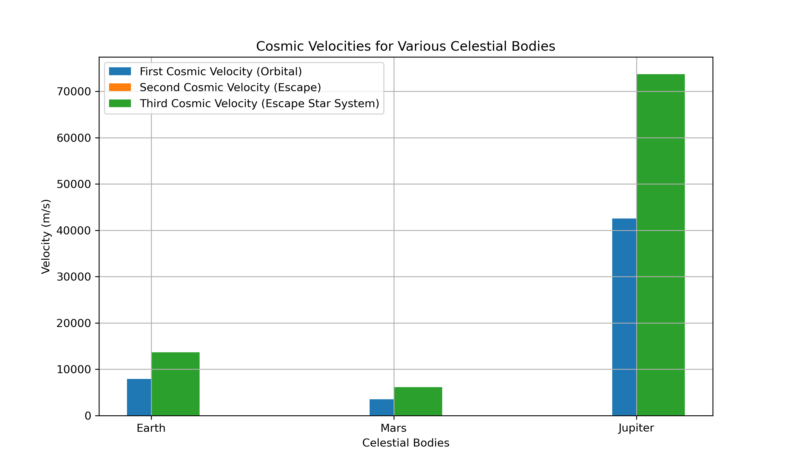

# Problem 2
# Escape Velocities and Cosmic Velocities

## Motivation
The concept of escape velocity is fundamental in understanding the speed needed for an object to break free from a celestial body's gravitational influence. Building on this, the first, second, and third cosmic velocities define the speeds necessary to:
1. **Achieve Orbit** (first cosmic velocity),
2. **Escape the Gravitational Influence** (second cosmic velocity), and
3. **Escape the Star System** (third cosmic velocity).

These velocities are essential for planning space missions, whether for launching satellites, interplanetary travel, or potential future interstellar missions.

## Cosmic Velocities
### 1. **First Cosmic Velocity** (\(v_1\)): Orbital Velocity
The first cosmic velocity is the speed needed for an object to achieve a stable circular orbit around a celestial body. It is the minimum velocity required to keep an object in orbit without falling back to the surface.

The formula for the first cosmic velocity is:

$$ v_1 = \sqrt{\frac{G M}{r}} $$

where:
- \( G \) is the gravitational constant (\(6.67430 \times 10^{-11} \, \text{m}^3 \, \text{kg}^{-1} \, \text{s}^{-2} \)),
- \( M \) is the mass of the celestial body (kg),
- \( r \) is the radius of the orbit (m).

### 2. **Second Cosmic Velocity** (\(v_2\)): Escape Velocity
The second cosmic velocity is the speed required to escape a celestial body's gravitational field without any further propulsion. An object at this velocity will move away from the body indefinitely.

The formula for the second cosmic velocity is:

$$ v_2 = \sqrt{\frac{2 G M}{r}} $$

### 3. **Third Cosmic Velocity** (\(v_3\)): Escape the Star System
The third cosmic velocity is the speed required to escape the gravitational influence of the central star (e.g., the Sun for planets in our solar system). It is the velocity needed to break free from the entire star system.

The formula for the third cosmic velocity is:

$$ v_3 = \sqrt{\frac{3 G M}{r}} $$

where:
- \( M \) is the mass of the star (e.g., the Sun for our solar system),
- \( r \) is the distance from the center of the star (in the case of Earth, this is the distance from Earth to the Sun).

## Calculation and Visualization for Various Celestial Bodies
We will now calculate the first, second, and third cosmic velocities for different celestial bodies such as Earth, Mars, and Jupiter.

### Python Script for Calculations and Visualizations

```python
import numpy as np
import matplotlib.pyplot as plt

# Gravitational constant (m^3 kg^-1 s^-2)
G = 6.67430e-11

# Define the masses (kg) and radii (m) of Earth, Mars, and Jupiter
celestial_bodies = {
    'Earth': {'mass': 5.972e24, 'radius': 6.371e6},
    'Mars': {'mass': 6.4171e23, 'radius': 3.396e6},
    'Jupiter': {'mass': 1.898e27, 'radius': 6.991e7}
}

# Function to calculate velocities
def cosmic_velocities(mass, radius):
    v1 = np.sqrt(G * mass / radius)  # First cosmic velocity
    v2 = np.sqrt(2 * G * mass / radius)  # Second cosmic velocity
    v3 = np.sqrt(3 * G * mass / radius)  # Third cosmic velocity
    return v1, v2, v3

# Store velocities for each celestial body
velocities = {}
for body, data in celestial_bodies.items():
    velocities[body] = cosmic_velocities(data['mass'], data['radius'])

# Plot the velocities
bodies = list(celestial_bodies.keys())
v1_vals = [velocities[body][0] for body in bodies]
v2_vals = [velocities[body][1] for body in bodies]
v3_vals = [velocities[body][2] for body in bodies]

plt.figure(figsize=(10, 6))
plt.bar(bodies, v1_vals, width=0.2, label="First Cosmic Velocity (Orbital)", align='center')
plt.bar(bodies, v2_vals, width=0.2, label="Second Cosmic Velocity (Escape)", align='edge')
plt.bar(bodies, v3_vals, width=0.2, label="Third Cosmic Velocity (Escape Star System)", align='edge')

plt.xlabel("Celestial Bodies")
plt.ylabel("Velocity (m/s)")
plt.title("Cosmic Velocities for Various Celestial Bodies")
plt.legend()
plt.grid(True)
plt.show()
```

#### **Visual Representation**

*Figure 1: Cosmic Velocities for Various Celestial Bodies.*