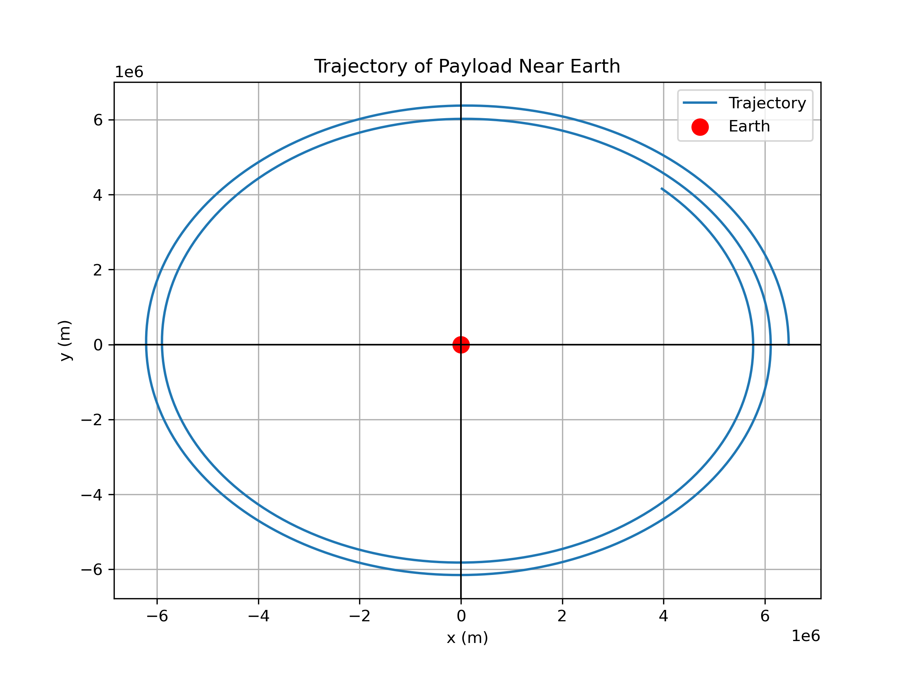

# Problem 3
# Trajectories of a Freely Released Payload Near Earth

## Motivation
When a payload is released from a moving rocket near Earth, its trajectory is influenced by initial conditions such as its position, velocity, and altitude, along with the gravitational forces exerted by Earth. The type of trajectory—whether parabolic, hyperbolic, or elliptical—depends on these initial conditions and the velocity at which the payload is released. Understanding these trajectories is crucial for space mission planning, satellite deployment, and even for reentry scenarios.

## Types of Trajectories
### 1. **Parabolic Trajectory**
A parabolic trajectory occurs when the object's velocity is exactly at the escape velocity at a given altitude. This type of trajectory results in the object following a curved path that eventually returns to Earth.

### 2. **Hyperbolic Trajectory**
A hyperbolic trajectory occurs when the object's velocity exceeds the escape velocity. This leads to an open trajectory that escapes Earth's gravitational influence. The object moves away from Earth indefinitely.

### 3. **Elliptical Trajectory**
An elliptical trajectory occurs when the object's velocity is between the orbital velocity and the escape velocity. This trajectory forms an ellipse with Earth at one of the foci, similar to how planets orbit the Sun.

## Mathematical Derivation
The motion of a freely released payload near Earth follows Newton's Law of Universal Gravitation, which can be expressed as:

$$ F = \frac{G M m}{r^2} $$

where:
- \( F \) is the gravitational force,
- \( G \) is the gravitational constant (\( 6.67430 \times 10^{-11} \, \text{m}^3 \, \text{kg}^{-1} \, \text{s}^{-2} \)),
- \( M \) is the mass of Earth,
- \( m \) is the mass of the payload,
- \( r \) is the distance from the center of Earth to the payload.

The equations of motion are derived from Newton's second law:

$$ \mathbf{F} = m \mathbf{a} $$

where \( \mathbf{a} \) is the acceleration of the payload. Using the gravitational force, we can model the acceleration of the payload. Depending on the initial conditions (position and velocity), the trajectory can take different forms.

### Energy Consideration
The specific orbital energy (\( \epsilon \)) of the object is a key factor in determining the trajectory:

$$ \epsilon = \frac{v^2}{2} - \frac{GM}{r} $$

- If \( \epsilon = 0 \), the trajectory is parabolic.
- If \( \epsilon > 0 \), the trajectory is hyperbolic (escape).
- If \( \epsilon < 0 \), the trajectory is elliptical (bound orbit).

## Numerical Simulation
To analyze the trajectory numerically, we solve the equations of motion using numerical integration (such as the Runge-Kutta method). The simulation will calculate the position and velocity of the payload over time based on initial conditions.

### Python Script for Simulating Trajectories

```python
import numpy as np
import matplotlib.pyplot as plt
from scipy.integrate import solve_ivp

# Gravitational constant and Earth's parameters
G = 6.67430e-11  # m^3 kg^-1 s^-2
M = 5.972e24  # kg (mass of Earth)
R_earth = 6.371e6  # m (radius of Earth)

# Function to compute the gravitational acceleration
def gravity(t, y):
    r = np.sqrt(y[0]**2 + y[1]**2)  # distance from the center of Earth
    ax = -G * M * y[0] / r**3
    ay = -G * M * y[1] / r**3
    return [y[2], y[3], ax, ay]  # dx/dt, dy/dt, acceleration in x and y directions

# Initial conditions: position (x0, y0), velocity (vx0, vy0)
# Example: A payload launched with an initial velocity tangent to Earth's surface
initial_conditions = [R_earth + 100000, 0, 0, 7800]  # 100 km altitude, 7800 m/s tangential velocity

# Time span and time points for integration
t_span = (0, 10000)  # 10,000 seconds
t_eval = np.linspace(0, 10000, 500)

# Solve the system of differential equations
sol = solve_ivp(gravity, t_span, initial_conditions, t_eval=t_eval)

# Plot the trajectory
plt.figure(figsize=(8, 6))
plt.plot(sol.y[0], sol.y[1], label="Trajectory")
plt.scatter([0], [0], color='r', label="Earth", s=100)  # Earth at origin
plt.title("Trajectory of Payload Near Earth")
plt.xlabel("x (m)")
plt.ylabel("y (m)")
plt.axhline(0, color='black',linewidth=1)
plt.axvline(0, color='black',linewidth=1)
plt.legend()
plt.grid(True)
plt.show()
```

#### **Visual Representation**

*Figure 1: Trajectory of Payload Near Earth".*