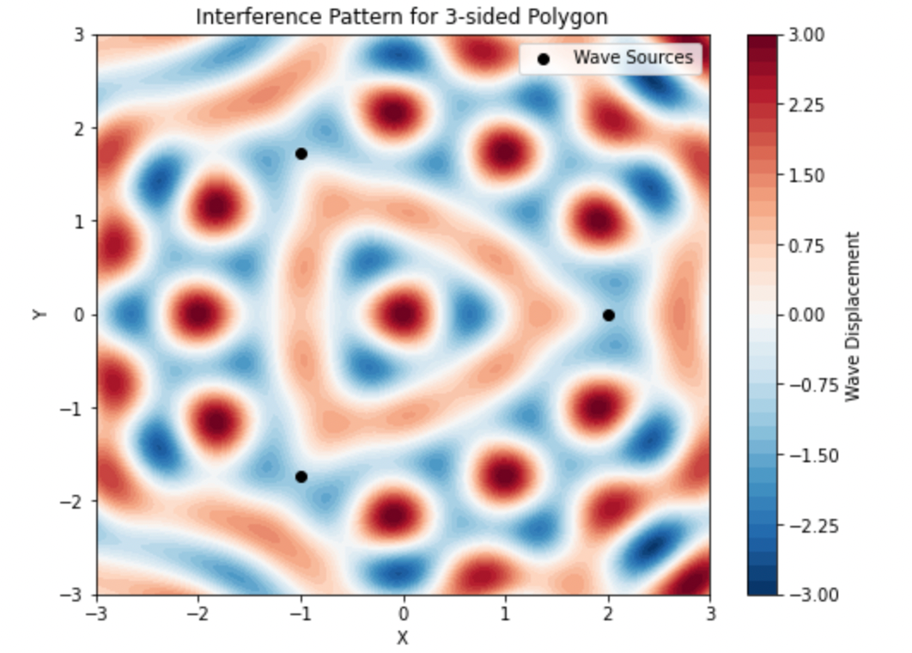
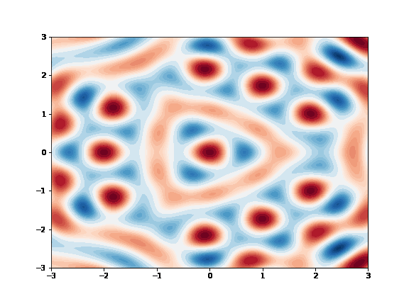

# Problem 1
# Interference Patterns on a Water Surface

## Motivation
Interference occurs when waves from different sources overlap, creating new patterns. On a water surface, this can be easily observed when ripples from different points meet, forming distinctive interference patterns. These patterns help us understand wave behavior, including constructive and destructive interference.

Studying these patterns allows us to explore:
- The relationship between wave phase and multiple wave sources.
- Constructive interference (amplification) and destructive interference (cancellation).
- Real-world applications such as acoustics, optics, and fluid dynamics.
- Understanding wave behavior in multi-source systems such as sound waves, electromagnetic waves, and water waves.

## Problem Statement
Analyze the interference patterns formed on a water surface due to the superposition of waves emitted from point sources placed at the vertices of a chosen regular polygon.

### Steps to Follow
1. **Select a Regular Polygon:** Choose a regular polygon (e.g., equilateral triangle, square, regular pentagon).
2. **Position the Sources:** Place point wave sources at the vertices of the selected polygon.
3. **Wave Equations:** Write the equations describing the waves emitted from each source, considering their respective positions.
4. **Superposition of Waves:** Apply the principle of superposition by summing the wave displacements at each point on the water surface:
   
   $$ 
   U(x, y, t) = \sum_{i=1}^{N} A \cos(k r_i - \omega t + \phi_0)
   $$

   where:
   - \( N \) is the number of sources (vertices of the polygon).
   - \( A \) is the wave amplitude.
   - \( k \) is the wave number.
   - \( r_i \) is the distance from the \( i \)-th source to a given point.
   - \( \omega \) is the angular frequency.
   - \( \phi_0 \) is the initial phase.

   
5. **Analyze Interference Patterns:** Examine the resulting displacement \( U(x, y, t) \) as a function of position and time. Identify regions of constructive and destructive interference.
6. **Visualization:** Use Python and plotting libraries to visualize the interference patterns.

## Implementation
The following Python script simulates and visualizes the interference pattern using `numpy` and `matplotlib`.
```python
import numpy as np
import matplotlib.pyplot as plt

# Parameters
A = 1  # Amplitude
wavelength = 1  # Wavelength
k = 2 * np.pi / wavelength  # Wave number
omega = 2 * np.pi  # Angular frequency
phi_0 = 0  # Initial phase
num_sources = 3  # Number of sources (triangle)
radius = 2  # Radius of the polygon

def wave_displacement(x, y, t, sources):
    displacement = np.zeros_like(x)
    for (x_s, y_s) in sources:
        r = np.sqrt((x - x_s)**2 + (y - y_s)**2)
        displacement += A * np.cos(k * r - omega * t + phi_0)
    return displacement

# Define the polygon vertices
angles = np.linspace(0, 2 * np.pi, num_sources, endpoint=False)
sources = [(radius * np.cos(a), radius * np.sin(a)) for a in angles]

# Create a grid
x = np.linspace(-3, 3, 200)
y = np.linspace(-3, 3, 200)
X, Y = np.meshgrid(x, y)
t = 0  # Snapshot at t=0

# Compute wave interference
Z = wave_displacement(X, Y, t, sources)

# Plot the interference pattern
plt.figure(figsize=(8, 6))
plt.contourf(X, Y, Z, levels=50, cmap='RdBu_r')
plt.colorbar(label='Wave Displacement')
plt.scatter(*zip(*sources), color='black', marker='o', label='Wave Sources')
plt.legend()
plt.xlabel('X')
plt.ylabel('Y')
plt.title(f'Interference Pattern for {num_sources}-sided Polygon')
plt.show()
```

*Figure 1: The Interference Pattern of Waves from Three Sources .*
### Explanation of Heatmap Script

The script generates a 2D heatmap showing the interference pattern of waves from three sources arranged in a triangle. The pattern displays alternating regions of high (red) and low (blue) wave displacement due to constructive and destructive interference, with the sources marked as black dots.

### Animated Wave Evolution
```python
import matplotlib.animation as animation

fig, ax = plt.subplots(figsize=(8, 6))
contour = ax.contourf(X, Y, wave_displacement(X, Y, 0, sources), levels=50, cmap='RdBu_r')
plt.colorbar(contour)
ax.set_title("Wave Interference Animation")

def update(frame):
    ax.clear()
    contour = ax.contourf(X, Y, wave_displacement(X, Y, frame * 0.1, sources), levels=50, cmap='RdBu_r')
    return contour.collections

ani = animation.FuncAnimation(fig, update, frames=100, interval=50, blit=False)
plt.show()
```

*Figure 2: Wave Interference Animation .*

## Analysis

This script creates an animated visualization of wave interference from three sources. It uses `matplotlib.animation.FuncAnimation` to update the wave displacement over time. The `update` function recalculates the interference pattern at each frame, producing a dynamic visualization of wave propagation. The color map (`RdBu_r`) highlights constructive (red) and destructive (blue) interference regions.

## Considerations

When analyzing the interference patterns in water waves, several important considerations and assumptions are made to simplify the model. These considerations ensure that the mathematical model is feasible and that the results are easier to interpret. However, real-world conditions may introduce additional complexities.
- **Same Amplitude, Wavelength, and Frequency**:  
    In this model, it is assumed that all the sources emit waves with the **same amplitude**, **wavelength**, and **frequency**. This uniformity ensures that the waves behave similarly and that the resulting interference patterns are driven solely by the **positions** and **phases** of the sources.

    The wave displacement from each source can be written as:

    $$
    \Psi(x, t) = A \sin(kx - \omega t + \phi)
    $$

    Where:  
    - \( A \) is the **amplitude** of the wave (same for all sources).  
    - \( k = \frac{2\pi}{\lambda} \) is the **wave number**, related to the **wavelength** \( \lambda \).  
    - \( \omega = 2\pi f \) is the **angular frequency**, related to the **frequency** \( f \).  
    - \( \phi \) is the **phase shift** of the wave.

    Since all sources have the **same amplitude**, **wavelength**, and **frequency**, the waves produced by these sources will behave similarly. The resulting **interference pattern** will depend on:
    - The **arrangement** of the sources in space.
    - The **phase relationships** between the waves.

---

- **Real-World Scenarios**:  
    In real-world scenarios, sources may emit waves with **different amplitudes**, **wavelengths**, or **frequencies**. These variations lead to more **complex interference patterns**, which may require more **advanced techniques** to analyze. This could include:
    - Considering the **frequency spectrum**.
    - Analyzing the **phase differences** between sources.


- **Coherence of Waves**: 
    - The waves are assumed to be **coherent**, meaning that they maintain a constant phase difference over time. This coherence is critical in producing stable and predictable interference patterns, such as the formation of constructive and destructive interference regions.
    - In practice, maintaining coherence over long periods or across large distances can be challenging due to environmental factors like temperature changes, fluid motion, or external disturbances.

```python
import numpy as np
import matplotlib.pyplot as plt
import matplotlib.animation as animation

# Define wave parameters
wavelength = 1.0  # Wavelength of the waves
k = 2 * np.pi / wavelength  # Wave number
omega = 2 * np.pi * 0.1  # Reduced angular frequency (slower speed)
phase_shift = 0  # Constant phase shift for coherence

# Define source positions
sources = np.array([[0, 0], [3, 0], [1.5, 2.5]])  # Three sources forming a triangle

# Define grid for visualization
x = np.linspace(-2, 5, 300)
y = np.linspace(-2, 5, 300)
X, Y = np.meshgrid(x, y)

def wave_displacement(X, Y, t, sources):
    """Computes the wave displacement at each point on the grid."""
    displacement = np.zeros_like(X, dtype=np.float64)
    for source in sources:
        r = np.sqrt((X - source[0])**2 + (Y - source[1])**2)  # Distance from source
        displacement += np.sin(k * r - omega * t + phase_shift)  # Coherent waves
    return displacement

# Create figure
fig, ax = plt.subplots(figsize=(8, 6))
contour = ax.contourf(X, Y, wave_displacement(X, Y, 0, sources), levels=50, cmap='RdBu_r')
plt.colorbar(contour)
ax.scatter(sources[:, 0], sources[:, 1], color='black', marker='o', label="Wave Sources")
ax.set_title("Slow Motion Coherent Wave Interference")
ax.legend()

# Update function for animation
def update(frame):
    ax.clear()
    contour = ax.contourf(X, Y, wave_displacement(X, Y, frame * 0.2, sources), levels=50, cmap='RdBu_r')
    ax.scatter(sources[:, 0], sources[:, 1], color='black', marker='o')  # Replot sources
    ax.set_title("Slow Motion Coherent Wave Interference")
    return contour.collections

# Create animation (slow motion effect with interval)
ani = animation.FuncAnimation(fig, update, frames=200, interval=100, blit=False)

# Display animation in Jupyter Notebook
from IPython.display import HTML
plt.close(fig)  # Prevents static plot display
HTML(ani.to_jshtml())
```

*Figure 3: Coherence of Waves .*

- **Idealized Water Surface**: 
    - The simulation assumes an **idealized water surface**, meaning that there are no external disturbances such as wind, obstacles, or changes in water properties. This simplified assumption makes it easier to visualize and understand the core concept of wave interference.
    - In real environments, factors like surface tension, viscosity, and external currents can influence the way waves interact. These factors could dampen the amplitude of the waves or alter their propagation speed.

- **External Disturbances and Real-World Factors**: 
    - **Wave Damping**: In real-world systems, waves often lose energy over time due to friction with the surface or absorption by the medium. This phenomenon, known as **damping**, would reduce the amplitude of the waves, altering the interference patterns, particularly over longer time scales or greater distances from the sources.
    - **Reflections**: Waves interacting with boundaries or other objects may be reflected back into the system, potentially leading to more complex interference patterns. These reflections could interfere with the original waves, causing constructive or destructive interference at different locations.
    - **External Disturbances**: Environmental factors such as wind, rain, or moving objects could introduce additional waves or random disturbances to the water surface. These external factors could significantly alter the clean, predictable interference patterns modeled in the simulation.

- **Extension to Three-Dimensional Interference**: 
    - The current model operates in **two dimensions**, assuming that the waves propagate on a flat surface. However, real-world wave interference is often more complex and can involve three-dimensional wave propagation.
    - Extending this model to three dimensions would allow for the exploration of more intricate interference patterns in volumetric spaces, such as within fluids or gases. This could be important in studying wave behavior in oceans or other large-scale fluid systems.
    - In three-dimensional systems, waves may interact in ways that create interference patterns not only on the surface but also throughout the volume of the medium, adding complexity to the analysis.

- **Interactions with Boundaries**: 
    - In the real world, boundaries (such as shorelines, walls, or barriers) can significantly affect wave propagation and interference. When waves encounter boundaries, they can be **reflected**, **refracted**, or **diffracted**, altering the interference patterns observed. These boundary effects are particularly important in confined or controlled systems, such as wave tanks or laboratories.
    - **Boundary conditions** (e.g., fixed, free, or absorbing) should be considered to account for how the waves interact with their environment and how these interactions influence the resulting interference patterns.

These considerations highlight the simplified nature of the model and emphasize the complexity of real-world wave interactions. Future studies can expand on these considerations by incorporating factors like wave damping, reflections, and boundary conditions to more accurately simulate and predict interference patterns in various physical scenarios.


## Applications

The study of interference patterns in waves has numerous practical applications across various fields. Some key domains where this knowledge is applied include:

- **Acoustics**: 
    - In acoustics, understanding the interference of sound waves is essential for designing spaces with optimal sound quality, such as concert halls, theaters, and recording studios. The interference patterns can be used to manage sound distribution, reduce unwanted echoes, and enhance sound clarity.
    - **Noise Cancellation Technology**: Active noise cancellation systems in headphones and other devices use sound wave interference to reduce unwanted background noise. By generating sound waves that are out of phase with the unwanted noise, destructive interference can effectively cancel it out, providing a quieter listening environment.

- **Optics**: 
    - In optics, interference patterns are foundational in the design of **anti-reflective coatings**. By carefully controlling the thickness and material properties of thin films, engineers can create coatings that minimize reflection and maximize light transmission in optical devices like lenses, cameras, and eyeglasses.
    - **Diffraction Gratings**: Interference is also central to the operation of diffraction gratings used in spectroscopy and optical instrumentation. These gratings split light into its component wavelengths by exploiting the interference of light waves as they pass through closely spaced slits or grooves.
    - **Holography**: Holography uses interference patterns to record and reconstruct three-dimensional images. By creating interference between light from a laser and light reflected off an object, a hologram captures the full depth and detail of an image.

- **Fluid Dynamics**: 
    - In fluid dynamics, interference patterns of water waves are used to understand phenomena like **wave reflection**, **wave focusing**, and **wave energy transfer**. The study of interference helps design systems such as **breakwaters** or **wave energy converters**, and it plays a crucial role in understanding the behavior of natural wave systems in oceans and lakes.
    - Understanding wave interference is also important in predicting the behavior of waves under various conditions, such as the interaction of waves with objects, vessels, or coastline features.

- **Quantum Mechanics**: 
    - Wave-particle duality is a central concept in quantum mechanics, and interference plays a crucial role in experiments that demonstrate this phenomenon. One of the most famous examples is the **double-slit experiment**, where particles (such as electrons) behave like waves, creating interference patterns that reveal the wave nature of particles.
    - Quantum interference is also important in the development of **quantum computing** and **quantum cryptography**, where controlling interference at the quantum level allows for the development of new technologies in data processing and security.

These applications showcase the broad impact of wave interference, influencing technologies in fields as diverse as communication, imaging, energy production, and scientific research.


## Conclusion
This experiment provides an intuitive way to study wave interference through simulations. The resulting patterns reveal how waves combine, reinforcing or canceling each other out in predictable ways. By adjusting the number and positions of sources, different interference patterns can be observed, helping us understand wave behavior in real-world applications. Further extensions of this study could involve wave reflections, damping effects, and three-dimensional wave interactions.
```
