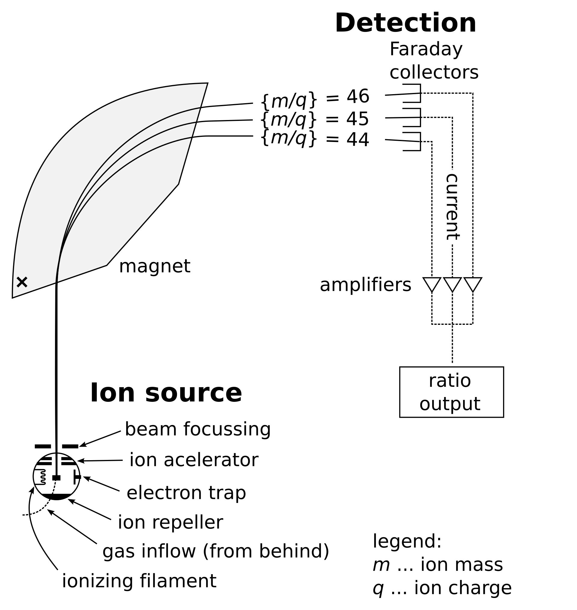
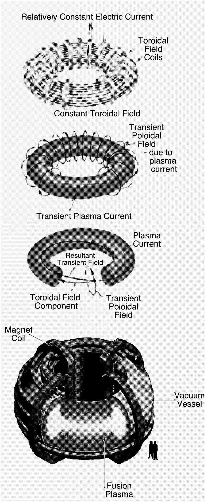
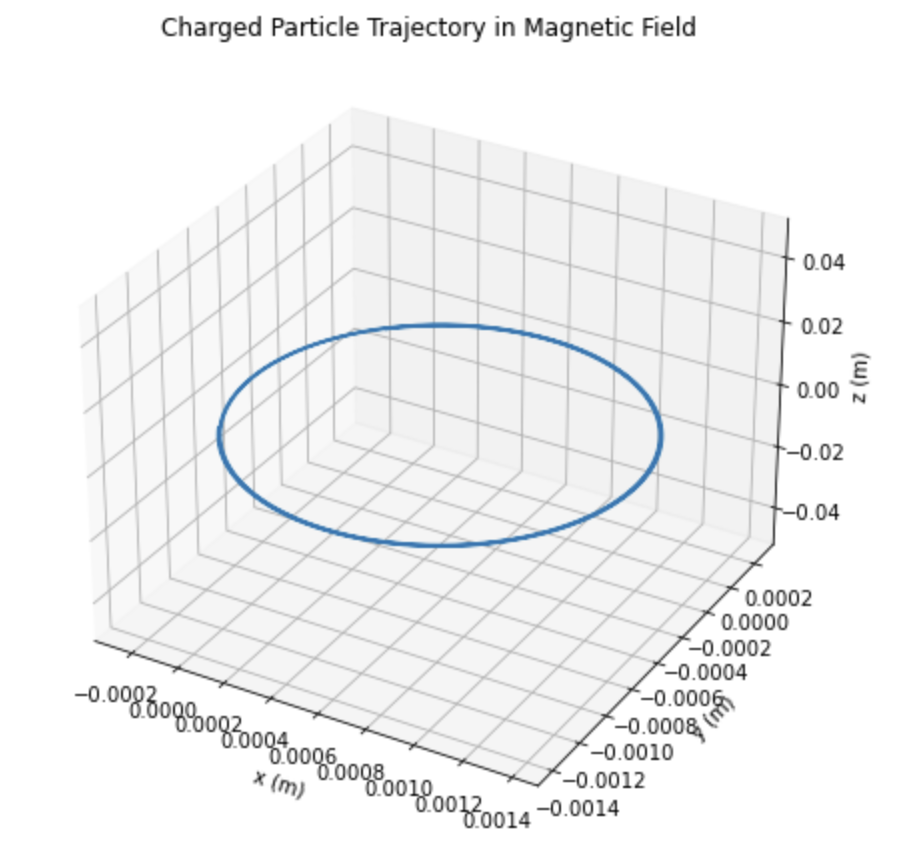

# Problem 1
## Simulating the Effects of the Lorentz Force
---
# Motivation

The **Lorentz force**, mathematically defined as:

$$
\vec{F} = q(\vec{E} + \vec{v} \times \vec{B}),
$$

governs the motion of **charged particles** in the presence of **electric fields** (\( \vec{E} \)) and **magnetic fields** (\( \vec{B} \)). This fundamental equation encapsulates the combined influence of electric and magnetic forces acting on a particle with charge \( q \) and velocity \( \vec{v} \). The electric field component (\( q\vec{E} \)) exerts a force aligned with \( \vec{E} \), while the magnetic field component (\( q\vec{v} \times \vec{B} \)) introduces a force perpendicular to both the particle’s velocity and the magnetic field, often resulting in complex, curved trajectories. This interplay is essential to understanding and predicting the behavior of charged particles across a wide range of physical systems.

The Lorentz force is a cornerstone in numerous scientific and technological domains, driving advancements and discoveries in:

- **Plasma Physics**: It dictates the motion of ions and electrons in ionized gases, enabling the study of phenomena like fusion processes in stars or laboratory plasma confinement for energy research.
- **Astrophysics**: It underpins the dynamics of charged particles in cosmic environments, such as the deflection of **solar wind** particles by Earth’s magnetic field, the behavior of particles in **planetary magnetospheres**, or the propagation of **cosmic rays** through the **interstellar medium**.
- **Mass Spectrometry**: It facilitates the separation and identification of ions based on their mass-to-charge ratios, a technique critical for chemical analysis and material characterization.
- **Particle Accelerators**: It powers devices like **cyclotrons**, **synchrotrons**, and **linear accelerators**, where precise control of electric and magnetic fields accelerates particles to relativistic speeds for experiments in particle physics and medical applications like cancer therapy.

Through computational simulations, we can observe and analyze the rich variety of **trajectories** and **interactions** that arise from the Lorentz force under different field configurations and initial conditions. By varying parameters—such as the strength and orientation of \( \vec{E} \) and \( \vec{B} \), or the particle’s initial position, velocity, and charge—simulations reveal behaviors ranging from simple linear motion to intricate helical paths or chaotic orbits. These virtual experiments provide insights into phenomena that are difficult or impractical to study directly, such as the motion of charged particles in the **Van Allen radiation belts**, the acceleration of particles in **solar flares**, or the design of next-generation accelerators. Moreover, simulations allow us to test theoretical predictions, optimize engineering designs, and explore hypothetical scenarios, bridging the gap between abstract theory and tangible applications.
# Objectives

## Applications of the Lorentz Force

The Lorentz force, with its ability to govern the motion of charged particles through electric and magnetic fields, finds practical utility across a diverse array of scientific and technological applications. Below, we explore how this fundamental principle is harnessed in various contexts, from precision instruments to cosmic phenomena, driving innovation and deepening our understanding of the universe.

- **Mass Spectrometers**: Mass spectrometers leverage the Lorentz force to separate ions based on their mass-to-charge ratio (\( m/q \)), a critical process in analytical chemistry and material science. When ions are injected into a mass spectrometer, they encounter a combination of electric and magnetic fields. The electric field accelerates the ions, while the magnetic field, applied perpendicular to their velocity, induces a curved trajectory via the \( q\vec{v} \times \vec{B} \) term. The radius of this curvature depends on the ion’s mass, charge, and velocity, allowing precise differentiation—lighter ions curve more sharply than heavier ones with the same charge. This technique is indispensable for identifying molecular compositions, detecting isotopes (e.g., carbon-12 vs. carbon-13), and analyzing complex samples, such as proteins in biological research or pollutants in environmental studies.

**The figure** below illustrates the schematics of a simple mass spectrometer equipped with a sector-type mass analyzer, specifically designed for measuring carbon dioxide isotope ratios (Isotope Ratio Mass Spectrometry, or IRMS), such as in the carbon-13 urea breath test. This setup harnesses the Lorentz force to separate ions based on their mass-to-charge ratio (\( m/q \)). Ions, generated from a sample (e.g., CO₂ gas), are accelerated by an electric field (\( \vec{E} \)) and then directed into a magnetic field (\( \vec{B} \)) region. The magnetic field, oriented perpendicular to the ions’ velocity, induces curved trajectories via the Lorentz force component \( q\vec{v} \times \vec{B} \). Lighter ions (e.g., \(^{12}\text{C}^{16}\text{O}_2\)) follow tighter curves, while heavier ions (e.g., \(^{13}\text{C}^{16}\text{O}_2\)) trace wider paths, enabling precise detection of isotopic compositions. In the carbon-13 urea breath test, this differentiation helps diagnose conditions like *Helicobacter pylori* infection by analyzing exhaled CO₂ isotope ratios.



- **Cyclotrons and Synchrotrons**: In particle accelerators like cyclotrons and synchrotrons, the Lorentz force is the engine behind accelerating charged particles to extraordinarily high speeds. Cyclotrons use a constant magnetic field to confine particles (e.g., protons or electrons) in a spiral path, while an oscillating electric field, timed to match the particle’s increasing orbit, provides periodic boosts in energy. The magnetic component (\( q\vec{v} \times \vec{B} \)) ensures circular motion, with the radius growing as the particle gains speed. Synchrotrons, an advanced evolution, adjust both the magnetic field strength and electric field frequency dynamically to keep particles in a fixed-radius orbit as they approach relativistic speeds. These accelerators are vital for high-energy physics experiments (e.g., probing subatomic particles at CERN) and medical applications, such as producing beams for radiation therapy to target tumors with precision.

- **Plasma Confinement**: Plasma confinement in fusion reactors relies heavily on the manipulation of magnetic fields through the Lorentz force to control the behavior of charged particles in a hot, ionized gas. In devices like tokamaks and stellarators, strong magnetic fields are engineered to trap and stabilize plasma—composed of ions and electrons—at temperatures exceeding millions of degrees, where nuclear fusion can occur. The Lorentz force’s magnetic component confines the particles in helical paths around magnetic field lines, preventing them from colliding with reactor walls and losing energy. This containment is crucial for sustaining fusion reactions, which aim to replicate the Sun’s energy production process, offering a potential pathway to clean, virtually limitless energy. Challenges like plasma instabilities and turbulence further highlight the Lorentz force’s role in ongoing research to achieve practical fusion power.


**The figure** below are components of the tokamak confinement configuration, one of the more advanced plasma confinement concepts. It uses a strong toroidal field created by external field coils (top) to stabilize the plasma while using a poloidal field created by a toroidal plasma current to confine the particles. The final configuration includes a large vacuum vessel to isolate the hot plasma from the surrounding environment (bottom). Courtesy of General Atomics and PPPL.



- **Charged Particle Beams in Astrophysical Jets**: In the vastness of space, the Lorentz force shapes the dynamics of charged particle beams within astrophysical jets—colossal streams of plasma ejected from objects like black holes, neutron stars, and active galactic nuclei. These jets, extending thousands of light-years, are propelled and collimated by cosmic magnetic fields interacting with charged particles (e.g., electrons and protons). The \( q\vec{v} \times \vec{B} \) term causes particles to spiral around magnetic field lines, focusing the jet into a narrow, high-energy beam that emits intense radiation, observable as radio waves, X-rays, or gamma rays. This process not only reveals the magnetic structure of cosmic environments but also influences star formation and galaxy evolution by redistributing energy and matter. Studying these jets through the lens of the Lorentz force enhances our understanding of extreme astrophysical phenomena and the fundamental forces at play across the universe.

These applications demonstrate the Lorentz force’s versatility, bridging laboratory-scale technologies with cosmic-scale processes. By manipulating electric and magnetic fields, we can harness this force to solve practical problems, advance scientific frontiers, and explore the mysteries of nature at every scale.

### Simulating Particle Motion

We simulate a charged particle's motion under the influence of:
- A **uniform magnetic field**
- **Uniform electric and magnetic fields**
- **Crossed electric and magnetic fields**

### Parameter Exploration

We vary:
- Electric field vector \( \vec{E} \)
- Magnetic field vector \( \vec{B} \)
- Initial velocity \( \vec{v}_0 \)
- Charge \( q \)
- Mass \( m \)

### Visualization

We plot:
- 2D and 3D trajectories of the particle.
- Different motion types: **circular**, **helical**, or **drift** motion.
- Illustrate concepts such as **Larmor radius** and **drift velocity**.

---

## Python Code: Lorentz Force Simulation

```python
import numpy as np
import matplotlib.pyplot as plt
from mpl_toolkits.mplot3d import Axes3D

# Define constants and initial conditions
q = 1.6e-19        # Charge of the particle (Coulombs)
m = 9.11e-31       # Mass of the particle (kg, electron)
B = np.array([0, 0, 1])  # Magnetic field (Tesla)
E = np.array([0, 0, 0])  # Electric field (V/m)
v0 = np.array([1e5, 0, 1e5])  # Initial velocity (m/s)

dt = 1e-11         # Time step (s)
t_max = 5e-7       # Total time (s)
steps = int(t_max / dt)

# Initialize arrays
r = np.zeros((steps, 3))
v = np.zeros((steps, 3))
r[0] = np.array([0, 0, 0])  # Initial position
v[0] = v0

# Simulation using Euler method
for i in range(steps - 1):
    F = q * (E + np.cross(v[i], B))  # Lorentz force
    a = F / m
    v[i+1] = v[i] + a * dt
    r[i+1] = r[i] + v[i] * dt

# Plotting the trajectory in 3D
fig = plt.figure(figsize=(10, 6))
ax = fig.add_subplot(111, projection='3d')
ax.plot(r[:,0], r[:,1], r[:,2], color='b', label='Trajectory')
ax.set_xlabel("X (m)")
ax.set_ylabel("Y (m)")
ax.set_zlabel("Z (m)")
ax.set_title("Trajectory of a Charged Particle in a Magnetic Field")
ax.legend()
plt.tight_layout()
plt.savefig("Lorentz_Trajectory.png", dpi=300)
plt.show()
```
---

## Visual Output

  
*Figure 1: Helical trajectory of a charged particle in a uniform magnetic field.*

---

## Observations

- In a **pure magnetic field**, the charged particle follows a **helical trajectory**.
- The **radius of the helix** (Larmor radius) depends on the perpendicular velocity:
  $$
  r_L = \frac{mv_\perp}{|q|B}
  $$
- Adding a **parallel electric field** accelerates the particle along the field lines.
- For **crossed E and B fields**, the particle experiences **drift motion** with drift velocity:
  $$
  \vec{v}_d = \frac{\vec{E} \times \vec{B}}{B^2}
  $$

---

## Conclusion

The Lorentz force produces a variety of complex, predictable motions depending on the field configuration and initial conditions. Through simulations:

- We observed **circular**, **helical**, and **drift** motions.
- We verified how the interplay between velocity, charge, mass, and field strength affects the motion.
- This provides insights into systems like **cyclotrons**, **mass spectrometers**, and **plasma containment** devices.

Simulations such as these bridge the gap between theoretical physics and real-world application, enabling us to **visually understand** and **quantitatively explore** electromagnetic effects.

---

## Suggestions for Extension

- Simulate motion in **non-uniform magnetic fields** (e.g., magnetic mirrors).
- Incorporate **relativistic dynamics** for high-speed particles.
- Implement **higher-order numerical methods** like Runge-Kutta.
- Animate trajectories using `matplotlib.animation` for dynamic visualization.
- Add support for multiple particles with different initial conditions and charges.

---

