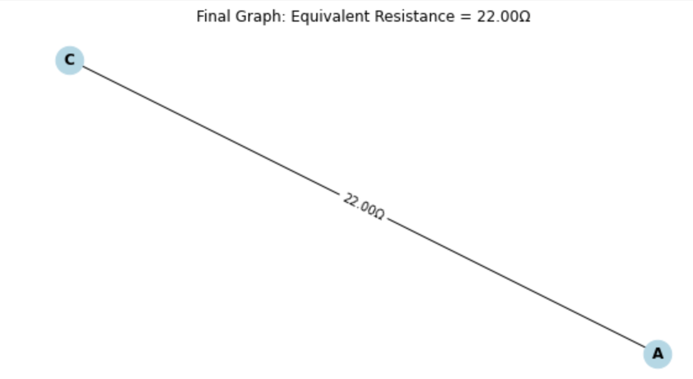

# Problem 1
# Motivation

Calculating equivalent resistance is a cornerstone of electrical circuit analysis, vital for designing efficient systems in electronics, power distribution, and beyond. Traditional methods—repeatedly applying series and parallel resistor formulas—work well for simple circuits but quickly become tedious and error-prone as complexity increases. Imagine a sprawling network of resistors: manually tracing paths and simplifying step-by-step feels like solving a puzzle without a clear strategy.

Graph theory transforms this challenge into an elegant, systematic process. By modeling a circuit as a graph—nodes as junctions, edges as resistors with weights—we unlock a structured way to simplify even the most tangled configurations. This isn’t just about convenience; it’s about power. Graph-based algorithms enable automation, paving the way for circuit simulation software, optimization tools, and scalable network design—think microchip layouts or power grids.

Beyond practicality, this approach is a playground for curiosity. It bridges physics and mathematics, revealing how abstract concepts like connectivity and traversal apply to real-world systems. Whether you’re an engineer streamlining a design or a student exploring interdisciplinary ideas, mastering equivalent resistance through graph theory sharpens your problem-solving toolkit and sparks deeper insights into the hidden patterns of circuits.

# Problem: Equivalent Resistance Using Graph Theory

### Option 2: Advanced Task – Full Implementation

**Task**: Implement an algorithm in a programming language to compute the equivalent resistance of a circuit graph. The implementation must:

- Accept a circuit graph as input.
- Handle arbitrary resistor configurations (series, parallel, nested).
- Output the final equivalent resistance.
- Test with examples: simple series/parallel, nested configurations, and complex graphs.

### Deliverables:

- Full Python implementation with explanations.
- Pseudocode for clarity.
- Three example test cases with step-by-step breakdowns.
- Brief analysis of efficiency and potential improvements.

# Solution

## Pseudocode

```plaintext
Algorithm ComputeEquivalentResistance(G, source, target):
    Input: Graph G (nodes = junctions, edges = resistors with weights), source node, target node
    Output: Equivalent resistance between source and target

    While G has more than one edge OR nodes ≠ {source, target}:
        // Series Reduction
        For each node n in G:
            If degree(n) = 2:
                neighbors = {n1, n2}
                r1 = sum of weights of edges between n and n1
                r2 = sum of weights of edges between n and n2
                Remove node n
                Add edge (n1, n2) with weight r1 + r2
                Continue

        // Parallel Reduction
        For each pair of nodes (n1, n2) in G:
            If multiple edges exist between n1 and n2:
                resistances = list of weights of edges between n1 and n2
                r_eq = 1 / (sum(1/r for r in resistances))
                Remove all edges between n1 and n2
                Add edge (n1, n2) with weight r_eq
                Continue

        If no reductions made:
            Error "Cannot reduce further"

    Return weight of edge (source, target)
```
# Full Implementation in Python

```python
import networkx as nx
import matplotlib.pyplot as plt

class CircuitSolver:
    def __init__(self):
        self.G = nx.MultiGraph()  # MultiGraph allows parallel resistors

    def add_resistor(self, node1, node2, resistance):
        self.G.add_edge(node1, node2, weight=resistance)

    def series_reduction(self):
        for node in list(self.G.nodes):
            if self.G.degree(node) == 2:
                neighbors = list(self.G.neighbors(node))
                if len(neighbors) == 2:  # Ensure two distinct neighbors
                    n1, n2 = neighbors
                    r1 = sum(d['weight'] for _, _, d in self.G.edges(node, data=True) if _ == n1)
                    r2 = sum(d['weight'] for _, _, d in self.G.edges(node, data=True) if _ == n2)
                    self.G.remove_node(node)
                    self.G.add_edge(n1, n2, weight=r1 + r2)
                    return True
        return False

    def parallel_reduction(self):
        for n1 in list(self.G.nodes):
            for n2 in list(self.G.nodes):
                if n1 < n2 and self.G.number_of_edges(n1, n2) > 1:
                    resistances = [d['weight'] for _, _, d in self.G.edges(n1, data=True) if _ == n2]
                    r_eq = 1 / sum(1/r for r in resistances)
                    self.G.remove_edges_from([(n1, n2) for _ in range(len(resistances))])
                    self.G.add_edge(n1, n2, weight=r_eq)
                    return True
        return False

    def compute_equivalent_resistance(self, source, target):
        while len(self.G.edges) > 1 or (len(self.G.edges) == 1 and sorted(self.G.nodes) != sorted([source, target])):
            if not (self.series_reduction() or self.parallel_reduction()):
                raise ValueError("Cannot reduce further; may need advanced methods.")
        return self.G[source][target][0]['weight']

    def draw_graph(self, title):
        pos = nx.spring_layout(self.G)
        plt.figure(figsize=(8, 4))
        nx.draw(self.G, pos, with_labels=True, node_color='lightblue', node_size=500, font_size=12, font_weight='bold')
        edge_labels = {(u, v): f"{d['weight']:.2f}Ω" for u, v, d in self.G.edges(data=True)}
        nx.draw_networkx_edge_labels(self.G, pos, edge_labels=edge_labels, font_size=10)
        plt.title(title)
        plt.show()

# Test cases with graphical representation
def test_circuit_solver():
    # Example 1: Series (10Ω + 20Ω)
    s1 = CircuitSolver()
    s1.add_resistor('A', 'B', 10)
    s1.add_resistor('B', 'C', 20)
    print("Example 1: Series (10Ω + 20Ω)")
    s1.draw_graph("Initial Graph: 10Ω + 20Ω in Series")
    result1 = s1.compute_equivalent_resistance('A', 'C')
    s1.draw_graph(f"Final Graph: Equivalent Resistance = {result1:.2f}Ω")
    print(f"Result: {result1:.2f}Ω\n")

    # Example 2: Parallel (10Ω || 20Ω)
    s2 = CircuitSolver()
    s2.add_resistor('A', 'B', 10)
    s2.add_resistor('A', 'B', 20)
    print("Example 2: Parallel (10Ω || 20Ω)")
    s2.draw_graph("Initial Graph: 10Ω || 20Ω in Parallel")
    result2 = s2.compute_equivalent_resistance('A', 'B')
    s2.draw_graph(f"Final Graph: Equivalent Resistance = {result2:.2f}Ω")
    print(f"Result: {result2:.2f}Ω\n")

    # Example 3: Nested (10Ω + (20Ω || 30Ω))
    s3 = CircuitSolver()
    s3.add_resistor('A', 'B', 10)
    s3.add_resistor('B', 'C', 20)
    s3.add_resistor('B', 'C', 30)
    print("Example 3: Nested (10Ω + (20Ω || 30Ω))")
    s3.draw_graph("Initial Graph: 10Ω + (20Ω || 30Ω)")
    result3 = s3.compute_equivalent_resistance('A', 'C')
    s3.draw_graph(f"Final Graph: Equivalent Resistance = {result3:.2f}Ω")
    print(f"Result: {result3:.2f}Ω")

if __name__ == "__main__":
    test_circuit_solver()
```
# Example Breakdowns

### Series (10Ω + 20Ω):
![Initial Graph Examp[e 1]](<Screenshot 2025-04-08 at 9.23.00 AM.png>)

- **Initial**: A --10Ω--> B --20Ω--> C
- **Step 1**: B (degree 2), combine 10Ω + 20Ω = 30Ω.
- **Final**: A --30Ω--> C.
- **Result**: 30Ω.

 

### Parallel (10Ω || 20Ω):


- **Initial**: A --10Ω--> B, A --20Ω--> B
- **Step 1**: Parallel, 1/R_eq = 1/10 + 1/20 = 0.15, R_eq = 6.67Ω.
- **Final**: A --6.67Ω--> B.
- **Result**: 6.67Ω.


### Nested (10Ω + (20Ω || 30Ω)):


- **Initial**: A --10Ω--> B --20Ω--> C, B --30Ω--> C
- **Step 1**: Parallel B-C, 1/R_eq = 1/20 + 1/30 = 0.0833, R_eq = 12Ω.
- **Step 2**: Series A-B-C, 10Ω + 12Ω = 22Ω.
- **Final**: A --22Ω--> C.
- **Result**: 22Ω.
 


# Efficiency and Improvements

### Efficiency:
- **Time Complexity**: O(|E| × (|V| + |E|)) in the worst case, as each reduction scans edges and nodes iteratively.

### Limitations:
- Fails on non-reducible graphs (e.g., Wheatstone bridge) without additional rules.

### Improvements:
- Add delta-star transformations for complex cycles.
- Optimize reduction order (e.g., prioritize parallel).
- Use adjacency list optimizations in `networkx` for larger graphs.

