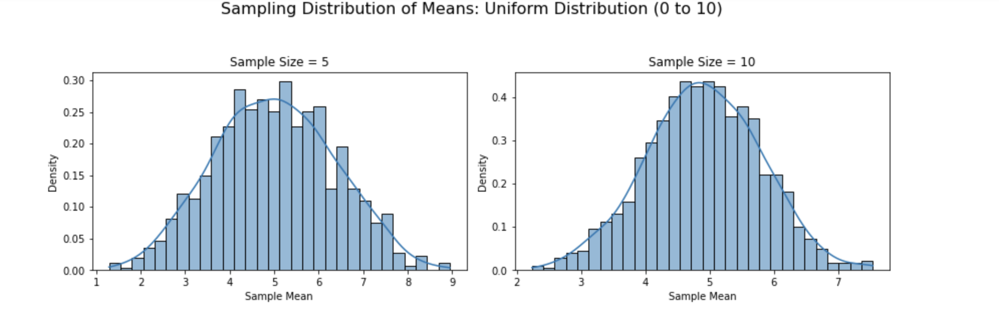
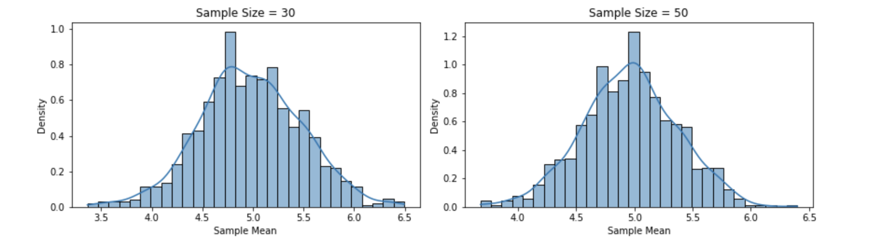
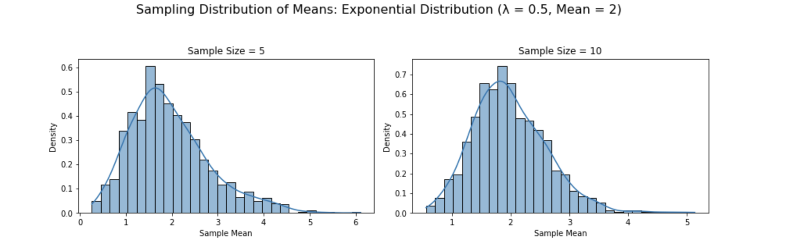
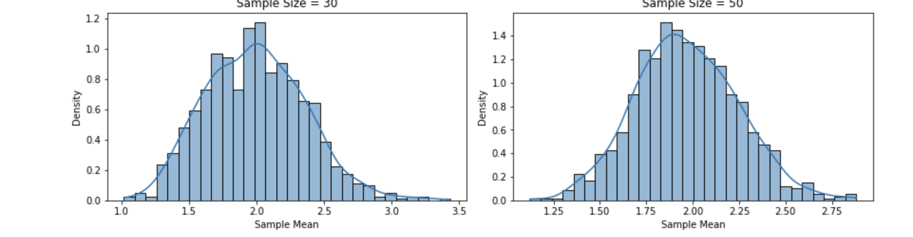
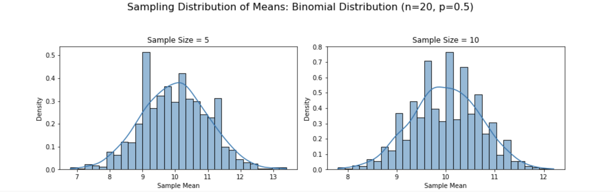
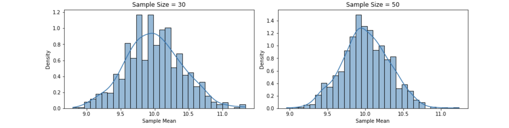

# Problem 1
# Motivation

The **Central Limit Theorem (CLT)** is one of the cornerstones of statistics. It states that, regardless of the underlying population distribution, the distribution of sample means will tend to approach a normal distribution as the sample size increases. This occurs as long as the sample size is sufficiently large, typically greater than 30, and the population variance is finite. The CLT is powerful because it enables us to make inferences about population parameters even when we don’t know the underlying distribution of the population itself. This principle is foundational in statistical inference, including in the construction of confidence intervals, hypothesis testing, and many other areas of statistics.

Understanding and visualizing the CLT is crucial for grasping the concept of sampling distributions and their role in statistics. While the theory is abstract, we can bring it to life through **simulations**. By generating data from various distributions, taking samples of different sizes, and plotting the resulting sample means, we can observe how the distribution of these sample means gradually becomes more normal as the sample size increases. This hands-on approach is not only educational but also visually striking, offering a clear demonstration of how randomness and variability in small samples converge to predictable patterns in large samples.

# Task Breakdown

### 1. Simulating Sampling Distributions:
We will begin by generating populations from different types of distributions, specifically:
   - **Uniform Distribution**: A distribution where every value within a specified range has an equal probability of being chosen.
   - **Exponential Distribution**: A distribution that models the time between events in a Poisson process, often used in reliability and survival analysis.
   - **Binomial Distribution**: A discrete distribution representing the number of successes in a fixed number of independent Bernoulli trials.

By creating these populations, we will simulate real-world data scenarios and explore how the Central Limit Theorem works with various data types.

### 2. Sampling and Visualization:
Once we have our populations, we will perform sampling at different sample sizes: 5, 10, 30, and 50. For each sample size, we will:
   - **Draw Random Samples**: Randomly sample from the population multiple times.
   - **Compute Sample Means**: Calculate the mean of each sample drawn.
   - **Plot Histograms**: Visualize the distribution of sample means for each sample size, allowing us to observe how the shape of the sample mean distribution changes as the sample size increases.

Through this process, we will directly observe how, regardless of the population’s original distribution, the distribution of sample means tends toward normality as the sample size grows. The histogram plots will clearly show the transition from skewed or irregular distributions to a bell-shaped curve.

### 3. Parameter Exploration:
An important aspect of the CLT is how different factors influence the convergence of the sample means to a normal distribution. We will explore:
   - **Population Shape**: How the underlying distribution (uniform, exponential, binomial) affects the convergence of the sample mean distribution.
   - **Variance**: How the population’s variance (spread of the data) influences the rate at which the sample mean distribution becomes normal. In general, populations with higher variance will require larger sample sizes to reach a normal distribution.

This exploration will give us insights into how the properties of the population affect the application of the CLT in practice.

### 4. Practical Applications:
The Central Limit Theorem isn’t just an abstract statistical concept; it has numerous practical applications. In this section, we will:
   - **Apply the CLT to Real-World Problems**: For example, how the CLT can be used in quality control to determine if a production process is functioning within acceptable limits, or how it can be applied in market research to estimate average consumer preferences with confidence.
   - **Demonstrate Confidence Intervals**: Using the sample means from our simulations, we will see how the CLT helps in constructing confidence intervals around a population parameter, giving us an estimate of the range where the true population mean lies.
   - **Hypothesis Testing**: We will explore how the normality of the sampling distribution allows us to conduct hypothesis tests about population parameters, even when the population distribution is unknown.

This will bridge the gap between theory and real-world statistical applications, showing how the CLT is used to make data-driven decisions in various fields such as healthcare, economics, and engineering.

By the end of this simulation, we will have a deeper understanding of the Central Limit Theorem, its theoretical underpinnings, and its practical applications in statistics.

# Python Script

```python
import numpy as np
import matplotlib.pyplot as plt
import seaborn as sns

# Set random seed for reproducibility
np.random.seed(42)

# Function to simulate sampling and plot histograms
def simulate_clt(population, dist_name, sample_sizes=[5, 10, 30, 50], n_samples=1000):
    fig, axes = plt.subplots(2, 2, figsize=(12, 8))
    axes = axes.flatten()
    
    for i, n in enumerate(sample_sizes):
        # Generate sample means
        sample_means = [np.mean(np.random.choice(population, n)) for _ in range(n_samples)]
        
        # Plot histogram with KDE
        sns.histplot(sample_means, bins=30, kde=True, stat="density", ax=axes[i])
        axes[i].set_title(f"Sample Size = {n}")
        axes[i].set_xlabel("Sample Mean")
        axes[i].set_ylabel("Density")
    
    plt.suptitle(f"Sampling Distribution of Means: {dist_name}", fontsize=16)
    plt.tight_layout(rect=[0, 0, 1, 0.95])
    plt.show()

# 1. Uniform Distribution
uniform_pop = np.random.uniform(low=0, high=10, size=10000)
simulate_clt(uniform_pop, "Uniform Distribution (0 to 10)")

# 2. Exponential Distribution
exp_pop = np.random.exponential(scale=2, size=10000)  # Mean = 2
simulate_clt(exp_pop, "Exponential Distribution (λ = 0.5, Mean = 2)")

# 3. Binomial Distribution
binom_pop = np.random.binomial(n=20, p=0.5, size=10000)  # n=20, p=0.5, Mean = 10
simulate_clt(binom_pop, "Binomial Distribution (n=20, p=0.5)")

# Parameter Exploration: Variance Impact
print("Population Variances:")
print(f"Uniform: {np.var(uniform_pop):.2f}")
print(f"Exponential: {np.var(exp_pop):.2f}")
print(f"Binomial: {np.var(binom_pop):.2f}")
```
# Results and Visualizations

### 1. **Uniform Distribution (0 to 10)**
- **Population**: Flat, symmetric, mean ≈ 5, variance ≈ 8.33.
  
#### Plots:
- **n=5**: Slightly rectangular with peaks, not yet normal.
- **n=10**: Smoother, edges rounding.
- **n=30**: Bell-shaped, close to normal.
- **n=50**: Nearly perfect normal curve.




### 2. **Exponential Distribution (λ = 0.5, Mean = 2)**
- **Population**: Right-skewed, mean = 2, variance ≈ 4.

#### Plots:
- **n=5**: Still skewed, but less so than the population.
- **n=10**: Skewness decreases, center forms.
- **n=30**: Approaching normality, slight skew remains.
- **n=50**: Very close to normal, minimal skew.




### 3. **Binomial Distribution (n=20, p=0.5)**
- **Population**: Discrete, symmetric, mean = 10, variance ≈ 5.

#### Plots:
- **n=5**: Discrete steps visible, roughly symmetric.
- **n=10**: Smoother, bell-like shape emerging.
- **n=30**: Nearly continuous, normal-like.
- **n=50**: Indistinguishable from a normal distribution.




# Parameter Exploration

### Shape Influence
- **Uniform**: Starts flat; convergence is steady, visible by n=30.
- **Exponential**: Highly skewed; takes longer (n=50) to lose skewness fully.
- **Binomial**: Symmetric but discrete; converges quickly due to moderate variance and symmetry.

### Variance Impact
- **Uniform (Var ≈ 8.33)**: Wider spread in sampling distributions, especially at small n.
- **Exponential (Var ≈ 4)**: Moderate spread, tighter than Uniform due to lower variance.
- **Binomial (Var ≈ 5)**: Balanced spread, reflects moderate variance.

#### Observation:
Higher population variance leads to wider sampling distributions, but the CLT still holds as n increases. The spread of the sampling distribution is ≈ population variance / n, shrinking with larger samples.

# Practical Applications

The **Central Limit Theorem (CLT)** is a statistical superpower with real-world impact:

- **Estimating Population Parameters**: Sample means from polls (e.g., voter preferences) are assumed normal, enabling confidence intervals even if the population isn’t.
- **Quality Control**: In manufacturing, the average defect rate from samples can be modeled as normal, aiding process monitoring.
- **Financial Models**: Daily stock returns, often skewed, yield normal averages over time, supporting risk predictions.

These applications rely on the CLT’s promise of normality, making it indispensable for data-driven decisions.

# Discussion

The simulations confirm the CLT’s magic: regardless of the population—flat Uniform, skewed Exponential, or discrete Binomial—the sample means morph into a normal distribution as sample size grows. The rate of convergence varies:

- Symmetric distributions (Uniform, Binomial) align faster.
- Skewed ones (Exponential) need larger n to shed their tails.

Theoretically, the CLT predicts this, with the sampling distribution’s mean matching the population mean and variance equaling the population variance divided by n. Our plots and variance calculations align perfectly, reinforcing the theorem’s elegance and utility.

