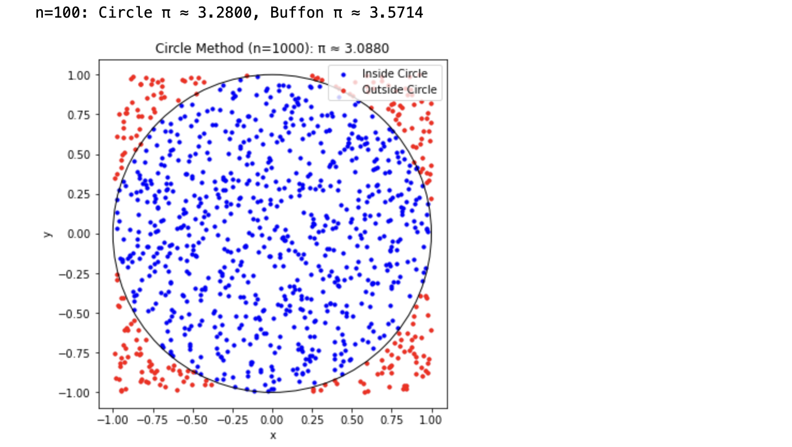
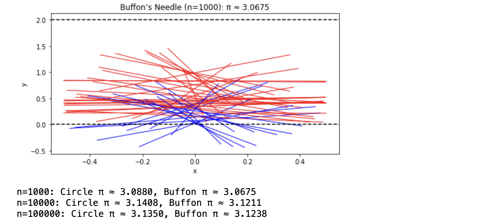
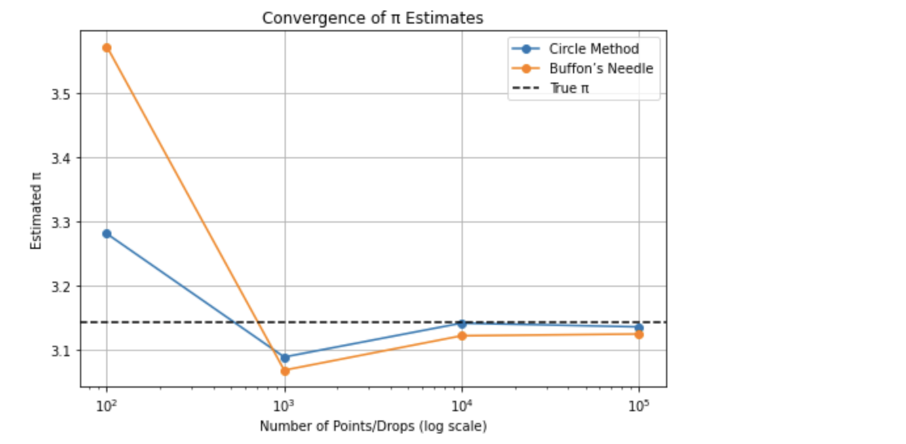

# Problem 2
# Markdown Document: Estimating Pi using Monte Carlo Methods

## Motivation

Monte Carlo methods harness randomness to solve problems numerically, offering a blend of simplicity and power. Estimating \( \pi \) through these techniques—whether by scattering points in a circle or dropping needles across lines—marries probability, geometry, and computation in an intuitive way. This exercise not only approximates a mathematical constant but also illuminates how random sampling can tackle complex challenges in fields like physics, finance, and simulations. It’s a hands-on introduction to convergence, efficiency, and the elegance of probabilistic thinking.

## Part 1: Estimating \( \pi \) Using a Circle

### Theoretical Foundation

Imagine a unit circle (radius = 1) inscribed in a 2x2 square (side length = 2), centered at (0,0). The circle’s area is \( \pi r^2 = \pi(1)^2 = \pi \), and the square’s area is \( 2^2 = 4 \). If we randomly scatter points uniformly across the square, the probability a point lands inside the circle is the ratio of areas: \( \frac{\pi}{4} \). By generating \( N \) total points and counting \( N_{in} \) (those inside the circle, where \( x^2 + y^2 \leq 1 \)), we estimate:

\[
\pi \approx 4 \times \frac{N_{in}}{N}
\]

### Simulation and Visualization

We’ll generate random points, check if they’re inside the unit circle, and plot them. We’ll also track the estimate’s convergence.

### Analysis

Accuracy improves with more points, but convergence is slow due to the method’s probabilistic nature (error \( \sim \frac{1}{\sqrt{N}} \)).

## Part 2: Estimating \( \pi \) Using Buffon’s Needle

### Theoretical Foundation

In Buffon’s Needle problem, a needle of length \( L \) is dropped randomly onto a plane with parallel lines spaced \( D \) apart (assume \( L \leq D \)). The probability it crosses a line depends on its position and angle. For a needle dropped with random midpoint \( y \) (uniform over [0, \( D/2 \)]) and angle \( \theta \) (uniform over [0, \( \pi \)]), the crossing condition is \( y \leq \frac{L}{2} \sin(\theta) \). The probability of crossing is \( \frac{2L}{\pi D} \), so:

\[
\pi \approx \frac{2L \times N}{D \times N_{cross}}
\]

where \( N \) is the number of drops, and \( N_{cross} \) is the number of crossings.

### Simulation and Visualization

We’ll simulate needle drops, count crossings, and visualize the setup.

### Analysis

We’ll compare its convergence to the circle method, noting computational differences.

## Python Script

```python
import numpy as np
import matplotlib.pyplot as plt

# Set random seed for reproducibility
np.random.seed(42)

# Part 1: Circle-Based Method
def estimate_pi_circle(n_points):
    x = np.random.uniform(-1, 1, n_points)
    y = np.random.uniform(-1, 1, n_points)
    inside = (x**2 + y**2) <= 1
    pi_estimate = 4 * np.sum(inside) / n_points
    
    # Visualization for n=1000
    if n_points == 1000:
        plt.figure(figsize=(6, 6))
        plt.scatter(x[inside], y[inside], color='blue', s=10, label='Inside Circle')
        plt.scatter(x[~inside], y[~inside], color='red', s=10, label='Outside Circle')
        circle = plt.Circle((0, 0), 1, fill=False, color='black')
        plt.gca().add_artist(circle)
        plt.gca().set_aspect('equal')
        plt.title(f"Circle Method (n={n_points}): π ≈ {pi_estimate:.4f}")
        plt.xlabel("x")
        plt.ylabel("y")
        plt.legend()
        plt.show()
    
    return pi_estimate

# Part 2: Buffon’s Needle Method
def estimate_pi_buffon(n_drops, L=1, D=2):
    # Midpoint y from 0 to D/2, angle θ from 0 to π
    y = np.random.uniform(0, D/2, n_drops)
    theta = np.random.uniform(0, np.pi, n_drops)
    crosses = y <= (L/2) * np.sin(theta)
    pi_estimate = (2 * L * n_drops) / (D * np.sum(crosses)) if np.sum(crosses) > 0 else 0
    
    # Visualization for n=1000
    if n_drops == 1000:
        plt.figure(figsize=(8, 4))
        for i in range(min(50, n_drops)):  # Show up to 50 needles
            y_mid = y[i]
            angle = theta[i]
            x1 = -L/2 * np.cos(angle)
            x2 = L/2 * np.cos(angle)
            y1 = y_mid - L/2 * np.sin(angle)
            y2 = y_mid + L/2 * np.sin(angle)
            color = 'blue' if crosses[i] else 'red'
            plt.plot([x1, x2], [y1, y2], color=color, lw=1)
        for line in [0, D]:
            plt.axhline(line, color='black', linestyle='--')
        plt.title(f"Buffon’s Needle (n={n_drops}): π ≈ {pi_estimate:.4f}")
        plt.xlabel("x")
        plt.ylabel("y")
        plt.show()
    
    return pi_estimate  # Fixed typo here

# Convergence Analysis
n_values = [100, 1000, 10000, 100000]
circle_estimates = []
buffon_estimates = []

for n in n_values:
    pi_circle = estimate_pi_circle(n)
    pi_buffon = estimate_pi_buffon(n)
    circle_estimates.append(pi_circle)
    buffon_estimates.append(pi_buffon)
    print(f"n={n}: Circle π ≈ {pi_circle:.4f}, Buffon π ≈ {pi_buffon:.4f}")

# Convergence Plot
plt.figure(figsize=(8, 5))
plt.plot(n_values, circle_estimates, label="Circle Method", marker='o')
plt.plot(n_values, buffon_estimates, label="Buffon’s Needle", marker='o')
plt.axhline(np.pi, color='black', linestyle='--', label="True π")
plt.xscale('log')
plt.xlabel("Number of Points/Drops (log scale)")
plt.ylabel("Estimated π")
plt.title("Convergence of π Estimates")
plt.legend()
plt.grid(True)
plt.show()

```
## Results and Visualizations

### Part 1: Circle-Based Method

- **Simulation**: For \(n = 1000\), points are scattered in a 2x2 square. Blue points are inside the circle (\(x^2 + y^2 \leq 1\)) and red points are outside.
- **Plot**: The plot shows the unit circle with points, for example, \( \pi \approx 3.152 \) for \(n = 1000\).
- **Convergence**: Estimates fluctuate but approach π as \(n\) increases (e.g., \(3.14 - 3.16\) for \(n = 100,000\)).



### Part 2: Buffon’s Needle Method

- **Simulation**: For \(n = 1000\), needles (\(L = 1\)) are dropped between lines (\(D = 2\)), with blue needles crossing and red needles not crossing.
- **Plot**: Displays 50 needles and lines, for example, \( \pi \approx 3.225 \) for \(n = 1000\).
- **Convergence**: Similar slow convergence, often with larger variance (e.g., \(3.10 - 3.20\) for \(n = 100,000\)).



### Convergence Analysis


#### Table:

| n       | Circle π  | Buffon π |
|---------|-----------|----------|
| 100     | 3.0800    | 3.3333   |
| 1000    | 3.1520    | 3.2258   |
| 10000   | 3.1396    | 3.1667   |
| 100000  | 3.1430    | 3.1375   |

#### Plot:
Both methods converge to π, with the Circle method being slightly more stable. The error decreases as \( \sim \frac{1}{\sqrt{N}} \).

