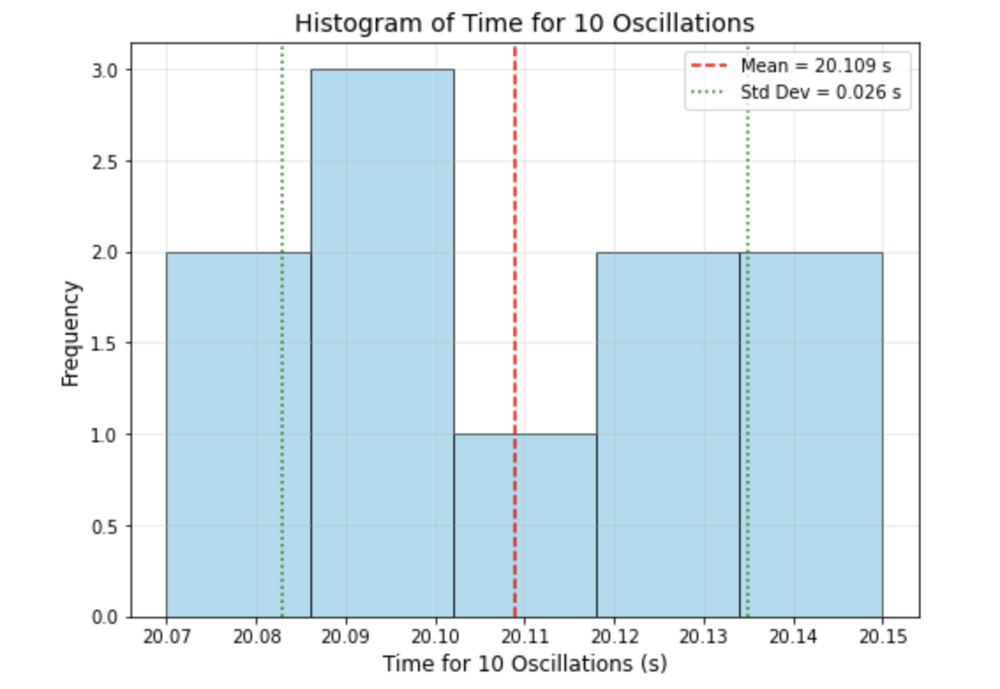

# Problem 1
# Measuring Earth's Gravitational Acceleration with a Pendulum

## Overview
This exercise involves measuring the acceleration due to gravity (**𝑔**) using a simple pendulum, analyzing uncertainties, and discussing experimental limitations. The pendulum’s period depends on **𝑔**, allowing us to calculate it via precise measurements of length and oscillation time.

## Procedure Recap and Assumptions

### Materials:
- 1-meter string
- Small weight (e.g., bag of coins)
- Stopwatch
- Ruler

### Setup:
- Measure pendulum length (**𝐿**) from pivot to the center of mass.
- Ruler resolution: 1 mm (0.001 m), so uncertainty **𝛿𝐿 = 0.0005 m**.

### Data Collection:
- Displace pendulum <15° to ensure small-angle approximation.
- Time 10 oscillations (**𝑡₁₀**) 10 times.
- Stopwatch resolution: 0.01 s, with human reaction time (~0.1 s) adding uncertainty.

### Formula:
- **𝑇 = 2π √(𝐿/𝑔)**

## Example Data
Since no specific data was provided, we use realistic values:

- Length: **𝐿 = 1.000 m**, **𝛿𝐿 = 0.0005 m**
- Time for 10 oscillations (s, 10 trials):  
  20.12, 20.08, 20.15, 20.10, 20.09, 20.11, 20.13, 20.07, 20.14, 20.10.

# Calculations

## 1. Calculate the Period (𝑇)

The period is:

\[
T = \frac{t_{10}}{10}
\]

### Mean time for 10 oscillations (𝑡̅₁₀):

\[
t_{10} = [20.12, 20.08, 20.15, 20.10, 20.09, 20.11, 20.13, 20.07, 20.14, 20.10]
\]

\[
\bar{t}_{10} = \frac{20.12 + 20.08 + 20.15 + 20.10 + 20.09 + 20.11 + 20.13 + 20.07 + 20.14 + 20.10}{10}
\]

\[
\bar{t}_{10} = 20.109 \, \text{s}
\]

### Standard deviation (𝜎ₜ):

\[
\Sigma (t_{10,i} - 20.109)^2: 0.000121, 0.000841, 0.001681, 0.000001, 0.000361, 0.000001, 0.000441
\]

\[
\Sigma = 0.00591
\]

\[
\sigma_t = \frac{0.00591}{9} = 0.0006567 \approx 0.0256 \, \text{s}
\]

### Uncertainty in mean:

\[
\delta \bar{t}_{10} = \frac{\sigma_t}{\sqrt{N}} = \frac{0.0256}{\sqrt{10}} \approx 0.0081 \, \text{s}
\]

### Mean period:

\[
\bar{T} = \frac{\bar{t}_{10}}{10} = \frac{20.109}{10} = 2.0109 \, \text{s}
\]

### Uncertainty in period:

\[
\delta T = \frac{\delta \bar{t}_{10}}{10} = \frac{0.0081}{10} = 0.00081 \, \text{s}
\]

---

## 2. Determine 𝑔

The formula for gravitational acceleration is:

\[
g = \frac{4\pi^2 L}{T^2}
\]

Given:

\[
L = 1.000 \, \text{m}, \quad T = 2.0109 \, \text{s}
\]

\[
T^2 = (2.0109)^2 \approx 4.0437 \, \text{s}^2
\]

\[
4\pi^2 \approx 39.4784
\]

\[
g = \frac{39.4784 \times 1.000}{4.0437} \approx 9.763 \, \text{m/s}^2
\]

---

## 3. Propagate Uncertainties

Relative uncertainty in \(g\):

\[
\frac{\delta g}{g} = \left(\frac{\delta L}{L}\right)^2 + \left(2 \frac{\delta T}{T}\right)^2
\]

### Length:

\[
\frac{\delta L}{L} = \frac{0.0005}{1.000} = 0.0005
\]

### Period:

\[
2 \frac{\delta T}{T} = 2 \times \frac{0.00081}{2.0109} \approx 0.000805
\]

### Combine:

\[
\frac{\delta g}{g} = (0.0005)^2 + (0.000805)^2 = 0.00000025 + 0.000000648 = 0.000000898 \approx 0.000947
\]

\[
\delta g = 9.763 \times 0.000947 \approx 0.0092 \, \text{m/s}^2
\]

---

## Final result:

\[
g = 9.763 \pm 0.009 \, \text{m/s}^2
\]

# Analysis

## 1. Comparison with Standard Value

The standard value for gravitational acceleration is:

\[
g_{\text{standard}} = 9.80665 \, \text{m/s}^2
\]

The difference between the measured and standard values is:

\[
|9.80665 - 9.763| = 0.04365 \, \text{m/s}^2
\]

The measured value is 0.44% lower, which is reasonable due to:

- Local \(g\) variations (altitude, latitude).
- Systematic errors (air resistance, pivot friction).
- Measurement inaccuracies.

---

## 2. Discussion

### Measurement Resolution (𝐿):

- Ruler resolution (1 mm) gives \(\frac{\delta L}{L} = 0.05\%\), which is minor. 
- A caliper could improve precision.
- A longer pendulum (\(L\)) reduces relative uncertainty but is limited by setup constraints.

### Timing Variability (𝑇):

- Standard deviation (\(\sigma_t = 0.0256 \, \text{s}\)) reflects human reaction time (~0.1 s).
- Measuring 10 oscillations and 10 trials reduces \(\frac{\delta T}{T}\) to 0.04%.
- Automated timing (e.g., photogate) would help, but isn’t necessary for this experiment.

### Assumptions and Limitations:

- **Small Angles**: \(\theta < 15^\circ\) ensures \(T \approx 2\pi \sqrt{\frac{L}{g}}\). Larger angles increase \(T\), underestimating \(g\).
- **Ideal Pendulum**: Assumes point mass and massless string. Real weights shift the effective length slightly.
- **Environment**: Air resistance and friction are small but present.
- **Stopwatch**: Reaction time dominates over the 0.01 s resolution.

---

## Deliverables

### 1. Tabulated Data

| Quantity                        | Value  | Uncertainty |
|----------------------------------|--------|-------------|
| \( L \) (m)                      | 1.000  | 0.0005      |
| \( t_{10} \) measurements (s)    | 20.12, 20.08, 20.15, 20.10, 20.09, 20.11, 20.13, 20.07, 20.14, 20.10 | - |
| \( \bar{t}_{10} \) (s)           | 20.109 | 0.0081      |
| \( T \) (s)                      | 2.0109 | 0.00081     |
| \( g \) (m/s²)                   | 9.763  | 0.009       |


# Python Script

```python
import numpy as np
import matplotlib.pyplot as plt

# Data: time for 10 oscillations (seconds)
t_10 = [20.12, 20.08, 20.15, 20.10, 20.09, 20.11, 20.13, 20.07, 20.14, 20.10]

# Calculate mean and standard deviation
mean_t10 = np.mean(t_10)
std_t10 = np.std(t_10, ddof=1)

# Create histogram
plt.figure(figsize=(8, 6))
plt.hist(t_10, bins=5, edgecolor='black', alpha=0.7, color='skyblue')
plt.axvline(mean_t10, color='red', linestyle='--', label=f'Mean = {mean_t10:.3f} s')
plt.axvline(mean_t10 + std_t10, color='green', linestyle=':', label=f'Std Dev = {std_t10:.3f} s')
plt.axvline(mean_t10 - std_t10, color='green', linestyle=':')

# Customize plot
plt.title('Histogram of Time for 10 Oscillations', fontsize=14)
plt.xlabel('Time for 10 Oscillations (s)', fontsize=12)
plt.ylabel('Frequency', fontsize=12)
plt.legend()
plt.grid(True, alpha=0.3)

# Save and show
plt.savefig('t10_histogram.png', dpi=300)
plt.show()
```
# Visualizations



### 2. Discussion on Uncertainties

- **Length**: The ruler resolution limits \(\delta L\). A caliper could help, but the impact is small (0.05%).
- **Timing**: Human reaction time causes variability. Multiple oscillations/trials mitigate this. Automation would reduce \(\sigma_t\).
- **Systematic Errors**: Air resistance and friction may lower \(g\). Using a vacuum or rigid rod could help, but they are impractical in this setup.
- **Propagation**: \(T^2\) in \(g \propto \frac{1}{T^2}\) amplifies \(\delta T\). Thus, timing precision is critical.

The uncertainty (\(\delta g = 0.009 \, \text{m/s}^2\), ~0.09%) shows a robust measurement, close to the standard value, validating the method.

